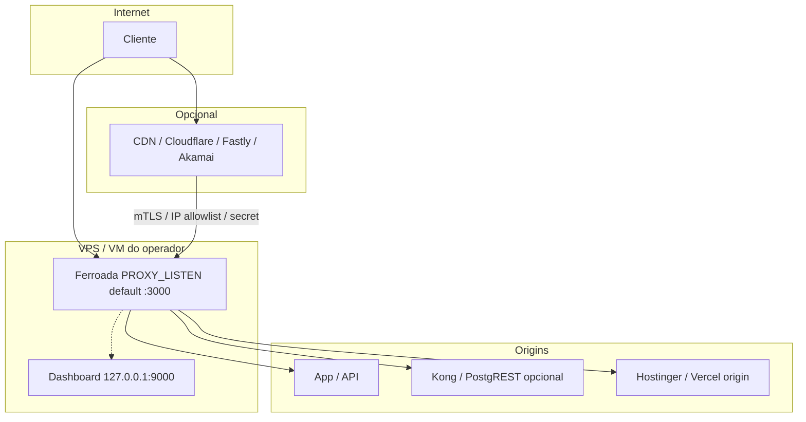
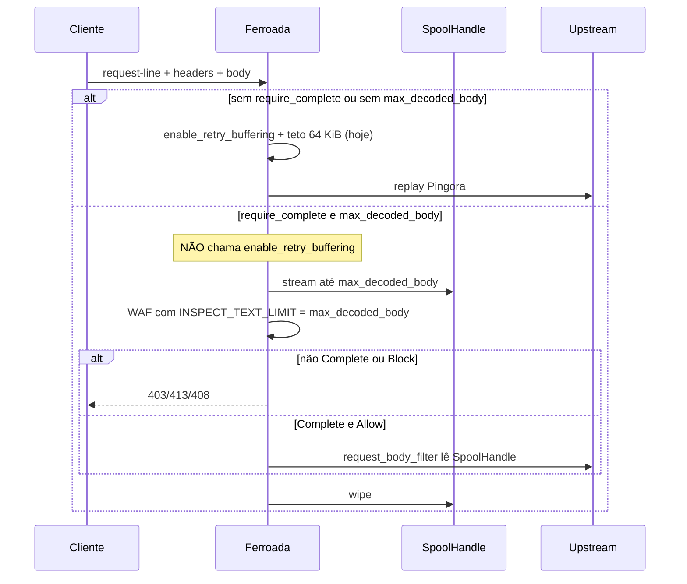

# Ferroada Origin Gateway

| Campo | Valor |
| --- | --- |
| Título | Ferroada como gateway de origem application-aware (modos de topologia + roadmap de segurança) |
| Autor | (a preencher) |
| Data | 2026-09-04 |
| Status | Accepted |
| Branch alvo | `feat/origin-gateway` |
| Código de referência | crate `ferroada` 0.6.0, Pingora `=0.8.1` (`Cargo.toml:12`, `Cargo.lock:1206-1207`) |

---

## Overview

O Ferroada já é um proxy Pingora com WAF regex, DLP inline, rate/behavior por site e dashboard em loopback. Falta o que o operador precisa no primeiro dia — um modo concreto para cada jeito real de hospedar o sistema — e o que o roadmap de segurança pede para o produto deixar de ser “proxy + assinaturas” e virar **o melhor gateway de segurança application-aware e self-hosted para proteger o origin**.

Este plano cobre os dois produtos na mesma branch `feat/origin-gateway`, em ondas incrementais:

1. **Modos de topologia** (ajuda imediata): packs gerados (`ferroada.toml`, env, compose, systemd, origin-lock, checklist de CDN/Vercel/Hostinger) para cada caso que o operador já tem — VPS com site, VPS só API, Supabase self-host ou Cloud, stack completa, Hostinger, Vercel, e o híbrido CDN → Ferroada → backend.
2. **Roadmap de segurança (Fases 0–9)**: contrato de protocolo, fechar o boundary HTTP que ainda fura, WAF maduro (Coraza/CRS como camada isolada), API-aware, DLP de verdade, abuse, HA, OTel e supply chain — **sem** fingir que o Ferroada substitui Cloudflare, Anycast ou scrubbing L3/L4.

Posicionamento comercial defensável:

> O Ferroada não substitui a proteção volumétrica do edge. Ele adiciona enforcement no origin, com contexto da aplicação, inspeção explícita, identidade e DLP inline que um WAF genérico de borda não oferece automaticamente.

---

## Background & Motivation

### O que o operador pede

Quem self-hosta o Ferroada não cai num único desenho. Os casos reais são:

- VPS com frontend + backend juntos
- VPS só com API (SPA em outro lugar)
- VPS + Supabase auto-hospedado
- VPS + Supabase Cloud
- Tudo na mesma VPS
- Build estático na Hostinger
- App só na Vercel

Hoje o README mostra um `docker run` e dois snippets de Compose (`README.md:259-500`). Não há pack por topologia, não há `ferroada init`, não há checklist de origin-lock, e o Compose de exemplo **publica o dashboard** (`-p 9000:9000` + `DASHBOARD_BIND=0.0.0.0`, `README.md:270-279` e `452-464`). Quem sobe “como no README” erra o default de produção.

### O que o roadmap de segurança pede

O material em `D:\ferroada.txt` trata o Ferroada atual como **alpha de segurança / começo do Level 1**. Várias queixas desse texto **já foram corrigidas no código 0.6.0** (ver gap analysis). O que permanece é estrutural: inspeção > 64 KiB esbarra no replay do Pingora; o painel Next ainda inventa métricas; não há PROXY protocol nem parser de `Forwarded`; o WAF é regex própria; não há Coraza, OpenAPI, control plane, Helm, OTel nem SBOM.

### Dor atual (evidência)

- O painel Next devolve **números de demonstração** quando o proxy falha (`web/src/lib/get-metrics.ts:16-31`). As páginas SSR já nascem com demo (`web/src/app/page.tsx:5`, `web/src/app/eventos/page.tsx:5`). Há banner, mas o operador pode ler 12 840 requisições e achar que o origin está vivo.
- O rewrite `/proxy-metrics` em `web/next.config.ts:2-4` encaminha para `/api/metrics` do dashboard **sem** `FERROADA_WEB_TOKEN` e **sem** injetar `FERROADA_TOKEN`. Se o Next e o dashboard compartilham o host e o dashboard está em loopback sem token, qualquer visitante do painel lê métricas.
- `Forwarded` / `CF-Connecting-IP` são **apagados** como hop-by-hop (`src/proxy.rs:1116-1130`) e **não** entram na identidade. Só `X-Forwarded-For` de `TRUSTED_PROXIES` conta (`src/client_ip.rs:115-139`).
- Body fail-closed já existe, mas só até 64 KiB — o teto do replay seguro do Pingora 0.8.1 (`src/shield.rs:10-36`, `README.md:114-116`). Rotas que precisam inspecionar upload/JSON maior não têm spool.
- DLP **mascara por padrão** (`DLP_ENABLED` default `true`, `src/dlp.rs:19-22`) e, se o buffer estoura, **libera o restante sem inspecionar** (`src/proxy.rs:1068-1082`). O txt pede default monitor e commit-point para `block`.

---

## Análise de gap (o txt está parcialmente obsoleto)

Não repropor o que 0.6.0 já entrega. Tabela honesta contra o código atual.

### Já entregue — não é trabalho novo

| Item que o txt ainda descreve como buraco | Estado no repo |
| --- | --- |
| Pingora 0.8.0 / smuggling do motor | Fixado `=0.8.1` (`Cargo.toml:12`, `Cargo.lock:1207`). HTTP/2: README declara 64 KiB de headers decodificados e 100 streams (defaults do 0.8.1; `ServerConf` usa `..Default::default()` em `src/main.rs:40-54`). |
| Body 10 MB com inspeção só nos 64 KB, sem status | `MAX_BODY_SIZE` teto 65536 (`src/shield.rs:10-36`). `InspectionStatus` {Complete, Truncated, UnsupportedEncoding, UnsupportedContentType} (`src/waf.rs:52-58`). Rotas fail-closed: `require_complete_waf_inspection` / `WAF_REQUIRE_COMPLETE_PATHS` (`src/config.rs:42-50`, `src/proxy.rs:837-854`). |
| DLP sem gzip e sem teto agregado | gzip/deflate com recompressão, skip observável de SSE/gRPC/NDJSON/WebSocket/assinadas, 1 MiB/resposta e 64 MiB de processo (`src/dlp.rs:25-128`, `src/proxy.rs:257-260`, `1001-1041`). Range removido; 206 textual → 502. |
| Dashboard token vazio + porta publicada | Bind default `127.0.0.1`; bind não-loopback exige token (`src/dashboard.rs:12-21`, `src/main.rs:87-95`). HTML nativo pede Bearer e guarda em `sessionStorage` (`src/dashboard.rs:216-236`). |
| Identidade = IP TCP cru | `TrustedProxies::resolve` + XFF direita→esquerda (`src/client_ip.rs:115-139`). `RiskIdentity` = site + IPv6 /64 + route group + hash de cookie/API key (`src/client_ip.rs:17-23`). Rate isolado por `SiteClientKey` (`RateLimiter::check` → `identity.network_key()`, `src/rate_limit.rs:85-97`); behavior isolado pela mesma chave (`check_and_record` → `identity.network_key()`, `src/behavioral.rs:170-186`). Testes de regressão: `sites_have_independent_budgets`, `sites_have_independent_behavior_profiles`. |
| Sem limites agregados | Conexões por IP e globais, conexões ativas, in-flight, headers, WAF in-flight, DLP in-flight, keep-alive (`src/connection.rs:28-36`, `src/proxy.rs:206-243`, `src/shield.rs:45-58`). |
| Framing CL+TE escondido pelo Pingora | Contagem no bloco HTTP/1 bruto antes da normalização (`src/proxy.rs:86-104`, `590-609`). `fail_to_proxy` não reutiliza downstream (`src/proxy.rs:912-915`). |
| cargo audit só no discurso | `Dockerfile:14` e `.github/workflows/security.yml:25-26` com `--deny warnings`; exceções transitivas do Pingora em `.cargo/audit.toml`. |
| Zero fuzz | `fuzz/fuzz_targets/{waf,protocol,dlp}.rs`; job CI só em `workflow_dispatch` (`security.yml:51-61`). |
| Sem health | `GET /healthz` e `GET /readyz` no dashboard (`src/dashboard.rs:84-96`). |
| “Não há SQL/Supabase neste repo” | Confirmado: busca no repo e `SMAUG_AUDIT.md:22`. |

### Ainda aberto — este design ataca

| Lacuna | Evidência | Fase |
| --- | --- | --- |
| Nenhum pack de topologia / `init` | Não há `deploy/`, `scripts/init`, nem subcomando; único CLI é o `Opt` do Pingora (`src/main.rs:56`). | Produto 1 |
| Demo metrics em produção | `web/src/lib/get-metrics.ts:16-31`; SSR demo em `page.tsx:5` e `eventos/page.tsx:5` | Fase 1 admin |
| Rewrite `/proxy-metrics` sem auth | `web/next.config.ts:2-4` | Fase 1 admin |
| Sem PROXY protocol v2 | `svc.add_tcp` / `add_tls` apenas (`src/main.rs:70-77`); Pingora 0.8.1 não expõe `enable_proxy_protocol()` — falta parser no `Stream` de `process_new` (TCP) e em `PreTlsProcess` (TLS) | Fase 1 identidade |
| `Forwarded` RFC 7239 não alimenta identidade | header é **stripped** (`src/proxy.rs:1116-1130`) | Fase 1 identidade |
| `InspectionStatus` sem ParseError / BudgetExceeded / TimedOut | `src/waf.rs:52-58`; JSON inválido vira “não canônico”, não erro (`src/waf.rs:505-513`) | Fase 1 inspeção |
| Sem spool > 64 KiB | replay Pingora; mismatch → 503 (`src/proxy.rs:808-820`) | Fase 1 inspeção |
| Sem strip de hop-by-hop nomeados por `Connection` | nenhum `remove_header("Connection")` no repo | Fase 1 HTTP |
| Sem checagem Host vs `:authority` | só Host allowlist (`src/shield.rs:178-204`) | Fase 1 HTTP |
| DLP default muta; overflow falha aberto | `src/dlp.rs:19-22`; `src/proxy.rs:1068-1082` | Fase 1 / 5 |
| Sem quota de memória/eventos por tenant | rate/behavior por site, métricas globais (`README.md:414`) | Fase 3 |
| WAF = regex própria | `src/waf.rs` (SQLi/XSS/…); não há Coraza/CRS | Fase 2 |
| Sem OpenAPI / GraphQL AST / gRPC protobuf | GraphQL textual cai na canonicalização de texto (`README.md:122`) | Fases 4–6 |
| Sem control plane, snapshots assinados, last-known-good | TOML + env no processo (`src/config.rs:63-84`) | Fase 3 |
| Sem Helm, unit systemd in-tree, OTel, SBOM, `SECURITY.md` | árvore: `src/`, `web/`, `fuzz/`, `Dockerfile`, CI | Fases 7–9 |
| Testes de socket de smuggling citados no audit | `SMAUG_AUDIT.md:12` descreve dois testes de socket; no código visível só o unitário `raw_framing_headers_preserve_cl_te_ambiguity` (`src/proxy.rs:1250-1256`) | Fase 1 HTTP |

### O txt erra números que o código já mudou

- “Body até 10 MB / DLP 50 MB”: agora 64 KiB de request e 1 MiB/resposta DLP.
- “DLP não inspeciona comprimidas”: inspeciona gzip/deflate.
- “Token do dashboard pode ficar vazio enquanto exemplos publicam admin”: o binário **recusa** bind externo sem token; os **exemplos do README ainda publicam 9000** — o buraco agora é documentação/pack, não o default do processo.
- “Tratar como alpha até revisar o código”: `SMAUG_AUDIT.md` (2026-08-31) já revisou o repo; isto não substitui auditoria externa (Fase 9), mas o ponto de partida não é mais “só README”.

---

## Goals & Non-Goals

### Goals

- Um **modo de topologia de primeira classe** para cada caso listado pelo operador, gerando artefatos executáveis (não só prosa).
- Defaults fail-closed nos packs de produção: dashboard loopback, token obrigatório, demo desligado, `TRUSTED_PROXIES` preenchido ou warning alto.
- Formalizar o **contrato de protocolo** (Fase 0) em config + testes: nada cai em “permitir” silencioso.
- Fechar o **boundary HTTP** que ainda falta (Fase 1): PROXY v2 (TCP em `process_new`, TLS em `PreTlsProcess`), Forwarded opt-in, InspectionOutcome completo, spool fail-closed **com os três tetos iguais**, hop-by-hop `Connection`, anti-desync com testes de socket, matar demo, listen configurável **com cap se :80**, `ferroada healthcheck`.
- Manter **zero dependências externas no data plane standalone**. Cluster, Coraza, OTel, Redis/etc. são opt-in.
- Três níveis de capacidade, todos válidos: **Level 1 drop-in** (zero mudança na app), **Level 2 declarativo** (OpenAPI/JWT/spec), **Level 3 application-aware** (authz externo opcional). Level 3 nunca é requisito para usar o produto.
- Posicionar como origin gateway; o desenho híbrido `Internet → CDN → mTLS/origem privada → Ferroada → backend` é o recomendado, não um apêndice.

### Non-Goals (explícitos)

- Anycast, BGP, DNS autoritativo, CDN, scrubbing L3/L4, PoPs, ASN próprio. Isso é empresa de infraestrutura, não este repo.
- Substituir Cloudflare / Fastly / Akamai.
- Reimplementar framing HTTP com regex. Pingora permanece o motor (`Cargo.toml:12`).
- SDK obrigatório na aplicação.
- SQL/Supabase **dentro** do crate Ferroada (continua sem banco).
- Declarar o produto “production-grade global” antes de assurance (Fase 9): auditoria externa, releases assinadas, LTS, FP medido.
- Helm, OIDC, SBOM, operator Kubernetes no PR 1.
- ML de bot no caminho quente. Shadow mode só depois de labels e feedback (Fase 6, onda tardia).
- Fetch de CIDRs no boot, no request path, ou como default silencioso do `init`.

### Invariantes (as 8 do txt — lei do data plane)

1. A representação inspecionada tem de ser semanticamente a encaminhada.
2. “Não achei ataque” ≠ “não inspecionei tudo”.
3. Todo recurso tem limite **agregado**, não só por request.
4. Nenhuma interface admin nasce exposta.
5. Política versionada, assinada, testável, canário, reversível (a partir da Fase 3; standalone = ficheiro local + checksum).
6. Toda decisão é explicável: rule ID, versão, representação, score, ação, política.
7. Isolamento por tenant: quota, score, regras, cardinalidade.
8. Data plane segue com last-known-good se o control plane cair.

---

## Proposed Design

### 1. Superfície de produto: templates + `ferroada init`

**Decisão:** os packs em `deploy/topologies/<nome>/` são a fonte revisável; `ferroada init` interpola a **cópia embutida** no crate (`include_str!`). Distroless só copia `/ferroada` (`Dockerfile:17-20`): sem embed, `init` no artefato que o operador corre não tem de onde ler. Um teste garante `include_str!` = ficheiros em `deploy/`. Operador sem o binário ainda copia o pack do git.

O `Opt::parse_args()` do Pingora hoje é o CLI inteiro (`src/main.rs:56`). Não brigar com ele: o `main` inspeciona `args[1]` **antes** de chamar Pingora. Subcomandos da onda 1: `init`, `healthcheck`, `cidrs update`. O binário distroless continua único. Nenhum destes corre no hot path (`src/proxy.rs`).

```text
ferroada init
  --topology vps-site|vps-api|vps-supabase-selfhost|vps-supabase-cloud|vps-full|hostinger-origin|vercel-origin|cdn-edge
  --out ./ferroada-deploy
  --public-host api.exemplo.com
  --origin http://127.0.0.1:8080
  --edge none|cloudflare|fastly|akamai|caddy|nginx
  --trusted-proxies "auto|none|CIDR,CIDR"
  --dashboard-token auto|<token>
  --static-placement ferroada-front|public|cdn   # só hostinger-origin
  --supabase-host supabase.exemplo.com          # só vps-supabase-cloud opção 2
  --listen-mode privileged|proxied              # privileged = :80+:443+cap; proxied = :3000+Caddy
  --non-interactive

ferroada healthcheck   # GET http://DASHBOARD_BIND:DASHBOARD_PORT/healthz; exit 0/1

ferroada cidrs update [--edge cloudflare|fastly|akamai]
                       [--cidrs-from-network]   # só neste comando, nunca no init
```

Um único par `--public-host` (SNI/Host que o Ferroada apresenta) + `--origin` (upstream). `hostinger-origin` e `vercel-origin` **recusam** `--non-interactive` sem `--public-host`. Não existe `--vps-public-host`. Placeholders: `{{PUBLIC_HOST}}`, `{{ORIGIN}}`, `{{SUPABASE_HOST}}`.

`--supabase-host` é obrigatório em `--non-interactive` na opção 2 de `vps-supabase-cloud`. **Não** prefixar `supabase.` em `--public-host` opaco (`api.exemplo.com` não vira `supabase.api.exemplo.com`). No TTY, perguntar o host. Default nenhum.

Modo interativo (stdin TTY, pt-BR) pergunta a mesma coisa. `--non-interactive` falha se faltar flag obrigatória — nunca inventa origin.

Cada pack emitido:

| Artefato | Função |
| --- | --- |
| `ferroada.toml` | sites, backends, fail-closed paths, WAF profile |
| `.env` e `.env.example` | secrets gerados + knobs que o **binário desta onda já honra**; `.env` em `.gitignore` do pack |
| `docker-compose.yml` | Ferroada + origin de exemplo (ou `external`); `80:3000` / `443:3443` |
| `ferroada.service` | systemd, `User=ferroada`, `Restart=on-failure`. Se o unit escuta :80/:443: `PROXY_LISTEN`/`TLS_LISTEN` **e** `AmbientCapabilities`+`CapabilityBoundingSet=CAP_NET_BIND_SERVICE`. Senão: :3000 + Caddy, sem cap. |
| `tmpfiles.d/ferroada.conf` | `d /var/lib/ferroada/spool 0700 ferroada ferroada` (onda spool) |
| `Caddyfile` / `nginx.conf.snippet` | só quando o edge local termina TLS **na frente** do Ferroada |
| `ORIGIN_LOCK.md` | firewall, allowlist de IP; header secreto só quando o knob existir (PR 10) |
| `VISIBILIDADE.md` | o que o Ferroada vê e o que **não** vê neste modo |
| `CHECKLIST.md` | Cloudflare / Vercel / Hostinger conforme o modo |

**Mapa de tokens (lei dos packs):**

| Variável | Quem usa | Relação |
| --- | --- | --- |
| `DASHBOARD_TOKEN` | processo Rust (`src/main.rs:92-95`) | segredo do dashboard |
| `FERROADA_TOKEN` | Next → proxy (`web/src/lib/get-metrics.ts:6-8`) | **o mesmo valor** que `DASHBOARD_TOKEN` |
| `FERROADA_WEB_TOKEN` | visitante → Route Handler Next (`web/src/app/api/metrics/route.ts:14-19`) | **outro** segredo, só o painel Next |

Profile `prod` **não sobe Next**. Só `DASHBOARD_TOKEN`. Admin via SSH tunnel (`ssh -L 9000:127.0.0.1:9000`). Compose de produção **não** mapeia `9000:9000`.

**PR 1 só emite knobs que 0.6.0 já cumpre.** Não gerar `DLP_ACTION`, `ORIGIN_SECRET_HEADER`, `PROXY_PROTOCOL`, `FERROADA_PRODUCTION`, `FERROADA_ALLOW_DEMO`, `PROXY_LISTEN` até o PR que os implementa. Defaults do PR 1:

```text
DASHBOARD_BIND=127.0.0.1
DASHBOARD_TOKEN=<32 bytes hex, gerado>
WAF_REQUIRE_COMPLETE_PATHS=/api/payment,/api/admin,/auth,/login
TRUSTED_PROXIES=<snapshot de deploy/cidrs/<edge>.txt; never empty no pack cdn-edge>
```

Packs sem edge (`vps-site` nu): `TRUSTED_PROXIES` vazio + WARNING, igual ao processo hoje (`src/main.rs:36-38`). Pack `cdn-edge`: preenchido pelo snapshot; `--trusted-proxies none` é escape hatch, não o default.

`DLP_ACTION=monitor` e origin secret entram nos packs no **PR 10**. `PROXY_PROTOCOL` só nos packs HAProxy/nginx/Caddy/NLB TCP no **PR 6**, nunca no `cdn-edge` Cloudflare.

**CIDRs (lei, combinação A + E + F — não o one-liner «snapshot agora, job depois»):**

- **A (onda 0, PR 1):** snapshots datados em `deploy/cidrs/{cloudflare,fastly,akamai}.txt`, também `include_str!`. Cabeçalho obrigatório com a URL oficial (Cloudflare: `https://www.cloudflare.com/ips-v4` e `ips-v6`) e a data do snapshot. Reproduzível, air-gapped, git-diffable.
- `ferroada init --trusted-proxies auto` **copia o snapshot** para `TRUSTED_PROXIES` no `.env`. **Não** faz HTTP. Dois operadores que correm `init` com o mesmo git obtêm a mesma lista.
- **E (PR 2b, comando de operador, mesma branch):** `ferroada cidrs update` descarrega a lista oficial, mostra o diff contra o snapshot em disco, escreve o ficheiro novo e/ou o `.env` se o operador confirmar. Last-known-good = o ficheiro em disco. O proxy **nunca** faz fetch de CIDRs — nem no boot, nem no request, nem em timer. Fora de `src/proxy.rs`. Flag opcional `--cidrs-from-network` existe **só** neste comando, nunca como default silencioso do `init`.
- **F (docs do pack `cdn-edge`, onda 0):** checklist exige Authenticated Origin Pulls (certificado cliente da Cloudflare verificado pelo Caddy / terminador TLS **à frente** do Ferroada). CIDRs continuam necessários para `TRUSTED_PROXIES` + firewall; origin pulls é a prova de que o peer é a Cloudflare. Client-auth no Pingora = Fase 7. Produção atrás da Cloudflare **deve** ligar origin pulls; só CIDR é o mínimo que arranca, não o alvo.

**Rejeitado na onda 0:**

- **C** — processo a buscar CIDRs no boot ou em periódico. Identidade não pode depender de `cloudflare.com` estar alcançável. Viola last-known-good.
- **B como default** — `init` **não** busca live. Dois `init` com uma semana de diferença dariam `TRUSTED_PROXIES` diferentes sem rasto no git.
- **D como default** — lista vazia / “cola tu”. Escape hatch `--trusted-proxies none` já loga que headers de IP serão ignorados (`src/main.rs:36-38`); **não** é o default do `cdn-edge`.

**Listen (lei):** o binário 0.6.0 hardcoda `0.0.0.0:3000` e TLS `0.0.0.0:3443` (`src/main.rs:70-77`). Docker já mapeia `"80:3000"` / `"443:3443"` (`README.md:440-442`). `CAP_NET_BIND_SERVICE` **não** muda a porta que o processo abre. Knob novo (PR de listen, antes do unit systemd prometer :80):

| Env | Default | Uso |
| --- | --- | --- |
| `PROXY_LISTEN` | `0.0.0.0:3000` | listener HTTP |
| `TLS_LISTEN` | `0.0.0.0:3443` | listener HTTPS (se certs) |

Packs Docker continuam `80:3000` (o processo fica em 3000; o mapa faz o :80). **Unit systemd que publica :80/:443 tem de trazer os dois**, no mesmo ficheiro — o binário não é setuid (`Dockerfile:17-20`, ENTRYPOINT `/ferroada`):

```ini
User=ferroada
Environment=PROXY_LISTEN=0.0.0.0:80
Environment=TLS_LISTEN=0.0.0.0:443
AmbientCapabilities=CAP_NET_BIND_SERVICE
CapabilityBoundingSet=CAP_NET_BIND_SERVICE
```

`CAP_NET_BIND_SERVICE` sozinha não muda a porta; `PROXY_LISTEN=:80` sozinho com `User=ferroada` falha o bind. **Não emitir `:80` no unit sem este par.**

Alternativa (sem cap): unit fica em `PROXY_LISTEN=127.0.0.1:3000` / `TLS_LISTEN=127.0.0.1:3443` e o pack põe Caddy/nginx na frente em :80/:443. O `init` gera **um** dos dois caminhos, nunca um híbrido.

**Healthcheck (lei):** `/healthz` e `/readyz` vivem no dashboard `:9000` (`src/dashboard.rs:84-96`), não no listener 3000. Distroless não tem curl (`Dockerfile:17-20`). Onda 1 **não** finge `HEALTHCHECK CMD curl`. Probe = subcomando `ferroada healthcheck` no mesmo binário (GET loopback `/healthz`, exit 0/1). `/readyz` faz `TcpStream::connect` nos backends (`src/dashboard.rs:37-50`) — em `vercel-origin`/`hostinger-origin` isso é TCP contra a internet; esses packs usam só `/healthz` (liveness do processo). Opcional no PR 3b: `GET /healthz` também no listener público (liveness barato, sem métricas).

### 2. Os oito modos (primeira classe)

O Ferroada é um **processo Pingora**. Não roda como serverless Vercel, nem em shared hosting Hostinger. Todo modo em que o origin público não é uma VPS/VM coloca uma VPS na frente. Mentir aqui é pior do que não ter o modo.



#### 2.1 `vps-site` — VPS self-host com site

Frontend + backend na mesma máquina. Público na VPS é 80/443 **via mapa Docker** (`80:3000`) ou, depois do knob, `PROXY_LISTEN=:80`. O processo 0.6.0 escuta 3000/3443 (`src/main.rs:70-77`).

```text
Internet → :80/:443 (mapa Docker ou PROXY_LISTEN) → Ferroada :3000/:3443 → 127.0.0.1:8080 (app)
                 └── dashboard 127.0.0.1:9000
```

- `TARGET_URL` ou um `[[sites]]` com o host público.
- **TLS (decidido):** se existem `TLS_CERT_PATH`/`TLS_KEY_PATH` (fullchain), o Ferroada termina TLS em `TLS_LISTEN`. Senão, Caddy na frente e Ferroada em `127.0.0.1:3000` (`--listen-mode proxied`). **Os dois nunca publicam :443 ao mesmo tempo.**
- Origin-lock: app escuta só `127.0.0.1` / rede docker interna. Firewall: 80/443 públicos; 8080 e 9000 fechados.
- **Vê:** todo HTTP da app. **Não vê:** WebSocket inspecionado, HTTP/3 (ação de não-suportado = deny na matriz).

#### 2.2 `vps-api` — VPS só backend

SPA/estático noutro sítio, ou sem frontend público. Ferroada frente à API.

- CORS e `ALLOWED_HOSTS` no host da API.
- Fail-closed default em `/api/`, `/auth/`, `/graphql`.
- **Vê:** API. **Não vê:** o JS hospedado na CDN/Hostinger/Vercel (e portanto não vê XSS refletido no estático).

#### 2.3 `vps-supabase-selfhost` — backend + Supabase auto-hospedado

O stack self-host típico expõe **Kong** como porta pública da API (PostgREST, GoTrue, Storage, Realtime via Kong). O pack **não** finge inspecionar o Postgres.

Roteamento honesto gerado:

```toml
[[sites]]
hosts = ["api.exemplo.com"]
backend = "http://kong:8000"
require_complete_waf_inspection = ["/auth/v1/token", "/rest/v1/"]
waf_profile = "generic"
```

- Studio (`:3000` típico) **não** entra no listener público. Se o operador insistir, o pack gera um site separado com warning: “Studio não é API; coloque auth extra ou SSH tunnel”.
- Realtime/WebSocket: ação da matriz = `bypass-explicit` na rota `/realtime/` (túnel limitado) ou `deny` se o app não precisa. Default do pack: `bypass-explicit` + evento observável.
- GoTrue cookies/JWT: Level 1 não valida JWT; Level 2 (onda posterior) pode apontar JWKS do GoTrue.
- Origin-lock: Kong e Postgres só na overlay; Ferroada é o único origin público (mapa 80:3000 / `PROXY_LISTEN`).
- **Vê:** HTTP via Kong. **Não vê:** SQL, RLS, replication, storage binário profundo (multipart com TE → `UnsupportedContentType` hoje, `src/waf.rs:473-480`; v1 da matriz **não** marca multipart como `inspect`).

#### 2.4 `vps-supabase-cloud` — backend na VPS, Supabase Cloud

O browser fala com `*.supabase.co` **direto**. O Ferroada **não** vê Auth/REST/Realtime da Cloud a menos que a app seja forçada a um BFF.

O pack oferece duas opções explícitas (pergunta do `init`):

1. **Recomendada — não proxyar a Cloud.** Ferroada frente só ao BFF/app (`TARGET_URL=http://app:8080`). `VISIBILIDADE.md` diz em pt-BR: “login, JWT e PostgREST passam fora do Ferroada; RLS no Supabase continua sendo a autorização.”
2. **BFF opcional, onda 1: host dedicado, não path.** `Config::resolve` só chaveia por Host (`src/config.rs:160-176`); o backend é um `SocketAddr` por site (`src/config.rs:31-38`). Não há strip de prefixo nem segundo upstream por rota, e nenhum PR 1–10 cria `[[sites.routes]]` como unidade de *proxy* (PR 5 é só inspeção). O `init` **não** gera `/supabase` como path. Gera:

```toml
[[sites]]
hosts = ["supabase.exemplo.com"]
backend = "https://<ref>.supabase.co"
```

`--supabase-host supabase.exemplo.com` preenche `hosts`. A app aponta `SUPABASE_URL` para `https://{{SUPABASE_HOST}}`. Checklist: cookie/CORS/redirect URLs do GoTrue; Host do upstream é o da Cloud (já `insert_header("Host", &backend.host)` em `src/proxy.rs:947-949`). Auth no browser pode continuar direto. SSRF: o origin é estático no TOML, não URL vinda do cliente. **Não** derivar o host prefixando `supabase.` a `--public-host`.

Path routing + allowlist de authority, se algum dia existir, é PR próprio **depois** da onda 1. Nunca gerar `backend = "https://*.supabase.co"` aberto. Nunca gerar um prefixo que o binário ignora.

#### 2.5 `vps-full` — tudo na VPS

Um Compose:

```text
ferroada (mapa 80:3000 / 443:3443)
app
(opcional) supabase self-host: kong, db, gotrue, …
dashboard Next só em profile `dev`
```

Profile `prod`: não publica 9000, **não sobe Next**, não finge `HEALTHCHECK` com curl. Liveness: `ferroada healthcheck` (PR do subcomando) contra `127.0.0.1:9000/healthz`. O binário distroless não inclui o Next (`Dockerfile:17-20`).

#### 2.6 `hostinger-origin` — build estático na Hostinger

**O Ferroada não roda em shared hosting Hostinger.** O modo é:

```text
Internet → [CDN opcional] → VPS Ferroada (PROXY_LISTEN / mapa 443:3443) → Hostinger (estático) e/ou API na VPS
```

`--origin` neste modo é o upstream da API (ou do estático, na sub-receita 1). Flag `--static-placement`:

1. `ferroada-front` (default): VPS origin público; Hostinger atrás de allowlist de IP da VPS. Header secreto `X-Ferroada-Origin` **só depois do PR 10**; até lá o checklist usa IP allowlist.
2. `public`: estático público na Hostinger (Ferroada **não** o protege); Ferroada protege só a API em `--origin`. `VISIBILIDADE.md` grita isso.
3. `cdn`: Cloudflare na frente do Ferroada; Hostinger como origin do cache de estático.

Hostinger shared não oferece mTLS de origin de verdade. Recusa `--non-interactive` sem `--public-host`.

#### 2.7 `vercel-origin` — app na Vercel

**O Ferroada não é uma serverless function.** Mesma geometria:

```text
Internet → VPS Ferroada (mapa 443:3443) → Vercel (Protection Bypass / IP allowlist)
```

`--origin` = URL de produção da Vercel. Recusa sem `--public-host`.

Checklist Vercel (pt-BR):

- Deployment Protection: IP da VPS em allowlist **ou** `x-vercel-protection-bypass` (header que o operador cola no env da Vercel; o pack PR 1 documenta, o Ferroada só injeta `ORIGIN_SECRET_HEADER` no **PR 10**).
- Serverless da Vercel continua responsável por authz da app; Ferroada faz Level 1 na borda da VPS.
- Opcional: Cloudflare → Ferroada → Vercel (`cdn-edge` + este origin).

Se o operador recusar VPS: o pack recusa gerar um “Ferroada na Vercel”. Mensagem: “Este processo precisa de uma VM. Use o modo cdn-edge com origin Vercel sem Ferroada, ou alugue uma VPS.”

#### 2.8 `cdn-edge` — híbrido recomendado pelo txt

```text
Internet → Cloudflare/Fastly/Akamai → mTLS ou origin privado → Ferroada → backend
```

- `TRUSTED_PROXIES` = snapshot em `deploy/cidrs/<edge>.txt` via `--trusted-proxies auto` (cópia local, sem HTTP). Atualizar depois = `ferroada cidrs update`, nunca o processo.
- **Cloudflare laranja não manda PROXY protocol** (manda `CF-Connecting-IP` / XFF). Este pack **não** liga `PROXY_PROTOCOL`. Identidade = CIDRs + XFF já existente; `CLIENT_IP_HEADER=cf-connecting-ip` só depois do PR 6, opt-in, peer confiável.
- `PROXY_PROTOCOL=true` só quando o hop imediatamente à frente é HAProxy/nginx/Caddy/NLB **TCP** que de facto prefixa v2.
- **F — Authenticated Origin Pulls (onda 0, checklist, não mTLS do Pingora):** o `CHECKLIST.md` do pack diz em pt-BR que produção atrás da Cloudflare **deve** ligar Authenticated Origin Pulls: o Caddy (ou o terminador TLS **à frente** do Ferroada) verifica o client cert da Cloudflare. CIDRs continuam no firewall e em `TRUSTED_PROXIES` (o mínimo que arranca). Origin pulls é a prova de que o peer é a Cloudflare. Client-auth no Pingora = Fase 7.
- `FORCE_HTTPS=true`, HSTS ligado (já condicionado a `FORCE_HTTPS`, `src/headers.rs:57-64`).
- `VISIBILIDADE.md`: DDoS L3/L4 é do CDN; se o link da VPS saturar, o Ferroada não responde 429 milagroso (`README.md:521-527` já é honesto — o pack repete).

### 3. Fase 0 — Contrato de protocolo (código, não wiki)

Dois eixos, não um enum misturado. O txt (`D:\ferroada.txt` Fase 0) tem colunas Bloquear / Inspecionar / Encaminhar **e** as quatro ações só para o **não suportado**.

- **`inspect`** = modo suportado: o L0 faz o que já faz (framing, WAF regex, DLP conforme content-type). Não é uma das quatro ações de fallback.
- **Não suportado / incompleto** usa só: `deny | monitor | bypass-explicit | route-to-quarantine`.
  - `deny` → 403/400 + `SecurityEvent` (`src/metrics.rs:46-52`) + métrica `protocol_<id>`.
  - `monitor` → permite + evento `protocol_monitor` (mesmo shape).
  - `bypass-explicit` → permite **sem** WAF de body; evento obrigatório (WebSocket hoje já pula DLP, `src/proxy.rs:1006-1010`).
  - `route-to-quarantine` **(decidido, v1):** mesma resposta que `deny` (403) + `SecurityEvent { event_type: "quarantine", detail: "<protocolo ou motivo>" }` (`src/metrics.rs:46-52`). Métrica `protocol_quarantine`. Não silenciar. Backend sink real = Fase 7 — a v1 **não** abre um origin honeypot.

`unknown` no TOML é **desdobrado**: `unknown_http_version`, `unknown_upgrade`, `unknown_encoding`, `unknown_content_type` — cada um com ação própria. Não há um `unknown = "deny"` ambíguo.

HTTP/1.0: o crate hoje **não lê versão** (nenhum `session.req_header().version` em `src/`). A matriz usa `http::Version` do header Pingora. Default `deny`.

Novo módulo `src/protocol.rs` + seção TOML. Tabela honesta L0 hoje vs default da matriz:

| Protocolo / conteúdo | L0 hoje (0.6.0) | Default da matriz | Ação se incompleto/não-suportado |
| --- | --- | --- | --- |
| HTTP/1.0 | aceite se passar nos filtros (versão não lida) | não suportado | `deny` |
| HTTP/1.1 | pipeline completo | `inspect` | — |
| HTTP/2 | Pingora + defaults 64 KiB / 100 streams | `inspect` | — |
| HTTP/3 | não há listener | não suportado | `deny` |
| WebSocket / `Upgrade` | DLP skip em 101 (`src/proxy.rs:1006-1010`); WAF não inspeciona frames | não suportado | `bypass-explicit` (evento) |
| SSE (request) | body como texto se `text/event-stream` | `inspect` no request | — |
| SSE (response) | DLP skip (`src/dlp.rs:38-44`) | n/a (resposta) | `bypass-explicit` no DLP |
| gRPC | `UnsupportedContentType` no WAF se `application/grpc` | não suportado | `deny` |
| JSON | parse opcional (`src/waf.rs:505-513`); lixo = texto cru | `inspect` | `ParseError` → ação da rota |
| gzip/deflate | inflate cap 256 KiB (`src/waf.rs:11`) | `inspect` | Truncated / UnsupportedEncoding |
| brotli | `UnsupportedEncoding` (`src/waf.rs:715`) | não suportado | `deny` em fail-closed; `monitor` no resto |
| multipart | TE não-7/8/binary → `UnsupportedContentType` (`src/waf.rs:473-480`); **não há parser por partes** | não suportado na v1 | `deny` se `require_complete`; senão `monitor`. **Não** `inspect` sem parser. |

Ameaça (ficheiro `docs/threat-model.md` **no PR 4**, coberta por um teste por linha deny/bypass): cliente externo, outro tenant, edge comprometido, backend malformado, control plane, ruleset, plugin, operador, dependência. Cada linha da matriz aponta a ação default. Nenhum caso cai em “permitir” silencioso.

`InspectionOutcome` substitui/estende `InspectionStatus`:

```rust
pub enum InspectionOutcome {
    Complete,
    Truncated { inspected: usize, total_hint: Option<usize> },
    UnsupportedEncoding,
    UnsupportedContentType,
    ParseError,
    BudgetExceeded,
    TimedOut,
}
```

Mapeamento: os quatro variantes atuais permanecem; gzip truncado no cap de inflate da rota (hoje 256 KiB globais, `src/waf.rs:729-731`; após PR 8, o cap da rota) vira `Truncated { inspected, .. }`; `BODY_READ_TIMEOUT` (`src/proxy.rs:29`, default 10s) que hoje devolve 408 (`src/proxy.rs:1188`) também registra `TimedOut`; reserva WAF esgotada já é 503 (`src/proxy.rs:752-759`) e passa a `BudgetExceeded`; JSON/XML irrecuperável → `ParseError` em vez de cair no texto cru.

Por rota (evolução do vetor de prefixos atual em `src/config.rs:38`):

```toml
[[sites]]
hosts = ["api.exemplo.com"]
backend = "http://app:8080"
require_complete_waf_inspection = ["/api/payment"]

[[sites.routes]]
prefix = "/api/payment"
inspection.require_complete = true
inspection.on_truncated = "deny"
inspection.on_parse_error = "deny"
# Campo do PR 8 — os três tetos (fio, texto, inflate) = este número. Ausente até lá; chave extra no TOML = erro de parse (PR 5, deny_unknown_fields).
inspection.max_decoded_body = "2MiB"
```

Até o TOML aninhado existir, `on_truncated=deny` é o significado de `require_complete_waf_inspection` (já é o caso em `src/proxy.rs:842-854`). A Fase 0 torna as outras ações configuráveis e testa a matriz.

`max_decoded_body` **não é só spool** e **não entra no PR 5**. Nasce no PR 8, na rota `require_complete`, e sobe os três tetos com o mesmo número (ver §4.3). Sem `require_complete`, erro de config no load. Antes do PR 8, a chave no TOML é parse error (`deny_unknown_fields`), não no-op.

### 4. Fase 1 — Boundary HTTP que ainda falta

O pipeline atual (`README.md:561-609`, `src/proxy.rs:367+`):

```text
HTTPS → Host → rota → method → size → rate → behavioral → WAF URI/headers
      → buffer body (≤64KiB) → WAF body → upstream → strip → security headers → DLP
```

Permanece. Acrescentos:

#### 4.1 Identidade

```text
peer TCP não confiável → ignorar todos os headers de IP
peer TCP confiável     → caminhar até o primeiro hop não confiável
```

Isso **já é** a lei do XFF em `TrustedProxies::resolve` (`src/client_ip.rs:115-139`; testes em `238-284`). Falta:

1. **PROXY protocol v2 implementado pelo Ferroada**, não um flag do Pingora. 0.8.1 não tem `enable_proxy_protocol()`. Dois hooks, porque os packs HAProxy/nginx/Caddy/NLB TCP são HTTP **claro** (TLS já terminado no hop da frente) e `PreTlsProcess` **não corre** em `add_tcp` (`src/main.rs:70`):

   - **TCP claro (o caso dos packs):** `ConnectionFilter::should_accept` só recebe `SocketAddr` (`src/connection.rs:256-258`) — não lê bytes. O sítio que já tem o `Stream` é `ServerApp::process_new` em `BoundedHttpApp` (`src/connection.rs:224-247`). Com `PROXY_PROTOCOL=true`, esse wrap lê o prefixo v2 do `Stream` **antes** de delegar ao HTTP app; teto 64 KiB+16; grava o IP no `SocketDigest` (de onde `client_addr` sai hoje, `src/proxy.rs:377-380`). Flag on e prefixo ≠ v2 → `return None` (conexão recusada, zero HTTP). Teste **sem TLS**: PROXY v2 + `GET /` → identidade do header; `GET /` cru com a flag on → conexão recusada.
   - **TLS:** `PreTlsProcess` (PROXY **antes** do handshake). Mesmo parser, mesmo teto, mesma recusa.

   Parser v2 próprio: assinatura 12 bytes, length, TLV. **Nunca** default em `:443` público sem hop TCP que fale PROXY. Packs: `true` só atrás de HAProxy/nginx/Caddy/NLB TCP. `cdn-edge` Cloudflare = CIDRs + XFF; `CLIENT_IP_HEADER` opt-in.
2. **RFC 7239 `Forwarded`** para identidade, **somente** se `TRUSTED_PROXIES` contém o peer **e** `FORWARDED_HEADER=accept`. Default continua **strip** (`src/proxy.rs:1116-1130`) — não reabrir spoof. Parser próprio, sem regex; `for=` IP; parar no primeiro hop não confiável, igual ao XFF.
3. Headers de CDN (`CF-Connecting-IP`, `True-Client-IP`, `Fastly-Client-IP`) só se `CLIENT_IP_HEADER=cf-connecting-ip` **e** peer confiável. Default: continuam stripped (`src/proxy.rs:1116-1130`).
4. Ordem **máxima** possível: `proxy_protocol,forwarded,x-forwarded-for,header`. **Default (lei da tabela API):** `proxy_protocol,x-forwarded-for`. `forwarded` só entra na lista quando `FORWARDED_HEADER=accept`. Testes de spoof iguais aos de XFF (`src/client_ip.rs:115-139`).

#### 4.2 Hop-by-hop e desync

- Remover headers listados em `Connection` (RFC 9110 §7.6.1) além da lista fixa atual.
- Rejeitar `Host` vs `:authority` divergentes em HTTP/2.
- Upgrade: só tratar como túnel **depois** de 101 (hoje DLP já skipa 101, `src/proxy.rs:1006-1010`; o protocol matrix decide se o Upgrade inicial é deny/bypass).
- Não reutilizar conexão após framing ruim: já `can_reuse_downstream: false` (`src/proxy.rs:912-915`); estender aos 400 de smuggling.
- Suíte de **socket** HTTP/1 e HTTP/2 (o audit descreveu, o tree não tem): CL+TE, TE duplicado, CL duplicado, TE não-chunked, HTTP/1→2 e 2→1, trailers. Zero request ao backend stub.

#### 4.3 Spool para fail-closed > 64 KiB

Problema real, não cosmética. Três tetos distintos hoje:

| Teto | Valor 0.6.0 | Onde |
| --- | --- | --- |
| Replay / `MAX_BODY_SIZE` | 65536 | `src/shield.rs:10-36`; hold-then-forward via `enable_retry_buffering` (`src/proxy.rs:777`) |
| Texto inspecionado | 65536 (`INSPECT_TEXT_LIMIT`) | corte em `src/waf.rs:12`, `492-501` |
| Inflate gzip/deflate | 256 KiB (`MAX_INFLATE_FOR_INSPECT`) | `src/waf.rs:11`, truncate `729-731` |

Hold-then-forward **já existe ≤ 64 KiB** (`src/proxy.rs:729-877`; mismatch do retry buffer → 503 em `808-820`). Isso **não** inspeciona além de 64 KiB de texto. Um POST 200 KiB com SQLi no último KiB numa rota `require_complete` hoje é 403 por `Truncated`, **não** porque o SQLi foi visto. `max_decoded_body = "2MiB"` na Fase 0 é mentira operacional até os **três** tetos subirem juntos.

**Lei:** os **três tetos usam o mesmo número** (`max_decoded_body`) na rota `require_complete`:

1. teto de bytes no fio (spool; substitui `MAX_BODY_SIZE` *nessa rota*);
2. teto de texto inspecionado (`INSPECT_TEXT_LIMIT` efetivo);
3. teto de inflate (`MAX_INFLATE_FOR_INSPECT` efetivo).

Gzip 100 KiB no fio / 5 MiB inflados com `max_decoded_body=256KiB`: o spool aceita o fio; o inflate corta em 256 KiB → `Truncated` + ação da rota (`on_truncated`). O nome não promete “5 MiB visíveis”. Zip bomb nunca é Complete.

Sem os três iguais, o origin receberia mais do que o WAF viu — viola invariantes 1 e 2.

Sem `require_complete`, `max_decoded_body` é **erro de config** no `Config::load`. Rota aberta permanece 413 no teto Pingora global.

**Reserva WAF em rota spool:** `request_inspection_reservation` hoje é `2 * body + inflate` porque há cópia local + replay Pingora (`src/proxy.rs:107-124`, `261-264`). Spool **não** liga replay → **não** conta `* 2`. Conta cópia de inspeção (memória; no disco a reserva é o buffer de leitura, não o ficheiro inteiro duas vezes) + inflate, contra `WAF_MAX_IN_FLIGHT_BYTES`. Disco conta em `SPOOL_MAX_BYTES`.

O campo `max_decoded_body` **nasce no PR 8**, junto dos três tetos. Até lá, chave desconhecida no TOML = erro de parse (`#[serde(deny_unknown_fields)]` no `ConfigFile`/`SiteEntry` a partir do PR 5 — hoje o serde ignora extras, `src/config.rs:8-28`).

**Contrato com o Pingora (PR 8 não é inventar na hora):**

`request_body_filter` hoje só faz `debug_assert` no replay (`src/proxy.rs:883-895`). O body ≤64 KiB vai no retry buffer (`enable_retry_buffering` em `777`); depois `take()` deita fora a cópia local (`876`). Spool **não pode** ligar esse buffer (teto 0.8.1).

- Rota spool → **não** chamar `enable_retry_buffering`.
- `FerroadaCtx` guarda `SpoolHandle` (memória se ≤ 256 KiB; senão ficheiro).
- `request_body_filter` lê o handle e põe chunks em `body`.
- IO / mismatch → 503 e **zero** bytes no stub (espírito de `808-820`).
- Inspeção corre sobre a **cópia** no spool; o que segue ao origin são **os mesmos bytes** recebidos (como inflate-for-inspect, `src/waf.rs:694-696`).



**Higiene (só quando o spool está ligado):**

- Default: `SPOOL_DIR` **unset = spool desligado**. Sem nenhuma rota com `max_decoded_body`, o arranque **não** cria dir, **não** recusa, **não** toca no disco. Compat 0.6.0: binário novo sem o knob sobe como hoje.
- Validar/wipe **somente** se `Config` tiver ao menos uma rota com `max_decoded_body`. Aí: `SPOOL_DIR` obrigatório (default `/var/lib/ferroada/spool`), dedicado; recusa se não existir; wipe leftover `spool-*` (kill -9/OOM não corre `Drop`); ficheiro que não case `spool-*` → recusa o boot **nesse** modo, não no default.
- Ficheiros prefixo `spool-*`, modo `0600`; `Drop` do ctx apaga (já há `Drop` para budgets, `src/proxy.rs:333`).
- `tokio` hoje é `features = ["net", "time"]` (`Cargo.toml:26`). PR 8 acrescenta `fs`.
- Orçamentos: `SPOOL_MAX_BYTES` 512 MiB, `SPOOL_MAX_FILES` 256, `ByteBudget` (`src/proxy.rs:178-197`) — só ativos com spool ligado.
- Packs da onda spool (rotas com `max_decoded_body`): volume, `tmpfiles.d`, `User=ferroada` com `useradd`. Distroless 0.6.0 corre root (`Dockerfile:17-20`).
- Não encaminhar o primeiro byte ao origin antes do outcome.

**Exit do PR 8 (não teatro):** POST 200 KiB, SQLi **no último KiB**, rota `require_complete` + `max_decoded_body = 256KiB` (aceita `Complete`) → 403 **porque o padrão bateu**, e zero bytes no stub. Um segundo teste: mesmo body **sem** o payload no fim → 200 e 200 KiB no stub. Estouro de `SPOOL_MAX_BYTES` → 503; ficheiro some no Drop **e** leftover some no boot **quando** o spool está ligado.

#### 4.4 Admin e demo

Binário:

- Packs não publicam 9000.
- O processo 0.6.0 permite loopback sem token (`validate_exposure`, `src/dashboard.rs:12-21`). **Incremento útil:** `FERROADA_PRODUCTION=true` torna `DASHBOARD_TOKEN` obrigatório **também** em 127.0.0.1. Não confundir com “HTML autenticado”.
- **Não** devolver 401 no documento HTML. O formulário de token **está** nesse HTML (`src/dashboard.rs:216-236`, `sessionStorage`). Bearer já é exigido só em `/api/metrics` e `/metrics` (`src/dashboard.rs:99-113`); o `_ => dashboard_html()` público (`115-123`) é o ramo de login. 401 no documento inteiro deixa o operador sem UI (SSH+curl não é o fluxo do pack).
- `/healthz` e `/readyz` públicos no dashboard estão corretos. Opcional: `/healthz` no listener público (liveness, sem métricas). Probe de Compose/systemd = `ferroada healthcheck`, não curl.

Painel Next (PR 3a, separado do Rust):

- **Remover** o rewrite `/proxy-metrics` (`web/next.config.ts:2-4`). O UI já fala com `/api/metrics` (`Dashboard.tsx:42`).
- Schema: `unavailable: z.boolean()` em `web/src/lib/types.ts` (hoje só `demo` + `demo_reason`, linhas 48-51).
- `getMetrics()`: proxy down → `{ demo: false, unavailable: true, requests_total: 0, … }` **nunca** `demoMetrics()`, salvo `FERROADA_ALLOW_DEMO=true`.
- SSR de `page.tsx` / `eventos/page.tsx`: zeros + `unavailable`, não `demoMetrics()`.
- Banner distinto, **não** reutilizar `demoMessage` (`Dashboard.tsx:16-24`): «O proxy não respondeu; os totais estão a zero de propósito.» Zeros com `demo: false` sem este ramo são o mesmo bug invertido.
- `demo.ts` permanece só para screenshot (`web/scripts/screenshot.mjs`) atrás da flag.
- Tokens: `FERROADA_TOKEN` = `DASHBOARD_TOKEN`; `FERROADA_WEB_TOKEN` é o do painel. Profile `prod` não sobe Next.

OIDC/mTLS admin: **não** nesta onda (PR 23). Token Bearer + loopback + `FERROADA_PRODUCTION` resolve o “nasce exposto”.

#### 4.5 Orçamentos — já no 0.6.0 / onda 1 / diferido

A Fase 1.3 do txt pede uma lista longa. Cobertura explícita (não fingir que a onda 1 fecha a Fase 1 inteira):

| Orçamento (txt Fase 1.3) | Estado |
| --- | --- |
| conexões simultâneas / por IP / globais | **0.6.0** `ConnectionRateFilter` (`src/connection.rs:28-36`) |
| requests em voo | **0.6.0** `MAX_IN_FLIGHT_REQUESTS` (`src/proxy.rs:222-227`) |
| tamanho e número de headers | **0.6.0** `MAX_HEADER_COUNT` / `MAX_HEADER_BYTES` (`src/shield.rs:45-58`) |
| bytes WAF em voo | **0.6.0** `WAF_MAX_IN_FLIGHT_BYTES` (`src/proxy.rs:261-264`) |
| bytes DLP em voo | **0.6.0** `DLP_MAX_IN_FLIGHT_BYTES` (`src/proxy.rs:257-260`) |
| keep-alive / retries | **0.6.0** (`src/proxy.rs:32-44`, `src/main.rs:123-128`, teto 3) |
| streams HTTP/2 e header list 64 KiB | **0.6.0** via `ServerConf { ..Default::default() }` (`src/main.rs:40-54`, `README.md:35-37`). Se um patch do Pingora mudar o default, **pinar** no `ServerConf` no mesmo PR que subir o crate — não confiar em memória. |
| camadas de Content-Encoding | **0.6.0** rejeita lista ≠ 1 (`src/waf.rs:709-710`) |
| spool agregado / ficheiros | **onda 1** PR 8 |
| profundidade JSON | **onda 1** PR 9 (32 → `ParseError`) |
| event quota por `site_scope` | **onda 1** PR 9 (hoje ring global 100, `src/metrics.rs:7`) |
| razão de inflate extra (10:1) | **onda 1** opcional no PR 8, junto do cap que sobe com `max_decoded_body` |
| handshake TLS, TTFB de header, taxa mínima de leitura | **Fase 7+** (não onda 1) |
| buffers por worker, filas, conexões upstream | **Fase 7+** (`pingora-load-balancing`) |
| partes multipart, profundidade XML | **Fase 2/4** (multipart v1 nem é `inspect`) |

Onda 1 de recursos = spool + JSON depth + event quota por site. O resto está na tabela, não “já feito”.

### 5. Fase 2 — WAF plataforma (depois do boundary)

```text
Protocol firewall (já: shield + framing)
        → L0 regex Ferroada (barato, manter)
        → L1 Coraza + CRS 4.25.x LTS (sidecar isolado)
        → Application policy (Fase 4)
```

**Decisão:** Coraza como **sidecar/processo separado** (Unix socket), não in-process e não reescrever CRS em Rust. Motivo: crash/loop no ruleset não mata o data plane (invariante 8 + critério Fase 2 do txt); standalone continua zero-deps (sidecar é opt-in no Compose); atualizar CRS não recompila o proxy.

L0 (`src/waf.rs`) permanece sempre-on, first cheap layer. L1 só se `WAF_ENGINE=coraza` e o socket existir. Timeout do sidecar é **configurável, default 500 ms** — CRS 4.25 no primeiro request (ou body gordo) não cabe em 20 ms; 20 ms + `fail_closed` = 403 em tráfego limpo no cold start. Ready probe do sidecar **antes** de marcar o engine `coraza`. Timeout/crash → `InspectionOutcome::TimedOut` + ação da rota (`fail_closed` / `fail_open_explicit`) e métrica `waf_engine_unavailable`. Nunca “desliga WAF no overload” em silêncio.

Recursos L1 (onda 2, não PR 1): rule IDs, paranoia, anomaly score, shadow, exclusão por rota, bundle assinado. Canonicalização: **não** “URL-decode 8 vezes como solução genérica” — o decode 8× atual (`src/waf.rs:14`) fica no L0; L1 usa as transformações do CRS.

### 6. Fases 3–9 — ondas posteriores (desenho, não implementação agora)

**Fase 3 — planos.** Standalone = TOML+env, last-known-good = o ficheiro que arrancou. Cluster (opt-in): control plane publica snapshot assinado; data plane não pede consenso no hot path. State plane: bucket local + contador regional assíncrono. Quota de memória/eventos **por `site_scope`** (`src/config.rs:34`).

**Fase 4 — API-aware (Level 2).** OpenAPI 3.0/3.1 compilado; unknown endpoint deny/observe; JWT com allowlist de alg, iss, aud, JWKS cacheado; bindings `jwt.sub == path.id` **declarativos**. GraphQL AST e gRPC descriptors depois de OpenAPI+JWT. Authz externo (OPA/Cedar/OpenFGA/webhook) é Level 3, Unix socket, fail_mode por rota.

**Fase 5 — DLP.** Knob `DLP_ACTION` no **PR 10**; packs de produção passam a emitir `monitor` **nesse** PR (PR 1 não mente o default). `redact`/`block` opt-in por rota. Commit-point: `block` não libera byte antes do fim. Overflow deixa de flush-uninspected (`src/proxy.rs:1068-1082`) em rotas `block`. Detectores CPF/CNPJ com dígito verificador; cartão com Luhn. Brotli quando o orçamento existir. Não mutar resposta assinada (já skip, `src/proxy.rs:1001-1008`).

**Fase 6 — bot/abuse: fora desta branch.** O txt pede RiskIdentity composta (ASN, JA4, challenges, stuffing, ML shadow). `RiskIdentity` 0.6.0 não tem ASN/JA4 (`src/client_ip.rs:17-23`). UA signatures (18, `src/shield.rs:214-232`) ficam como sinal fraco. jwt.sub/tenant entram com Level 2 (PRs 13–14). Challenges/pluggable **não** têm PR 1–23. Não tratar o roadmap 0–9 como se esta branch o desendesse ao mesmo nível.

**Fase 7 — HA.** Usar `pingora-load-balancing` (já transitivo no lock, `Cargo.lock:1213`) em vez de um `HttpPeer` (`src/proxy.rs:932`). Health ativo/passivo, circuit breaker, retry só idempotente (`MAX_UPSTREAM_RETRIES` já teto 3). Origin mTLS. Systemd no pack (Fase 1). Helm **depois**. Overload: shed 429/503; nunca desligar WAF/DLP em silêncio.

**Fase 8 — OTel.** Export OTLP opt-in; o ring buffer local permanece. Não logar `Authorization` nem payload por default. Métricas: as que já existem em `src/metrics.rs:11-43` + `inspection_outcome`, `spool_bytes`, `policy_version`.

**Fase 9 — assurance.** Fuzz no CI de PR (hoje só `workflow_dispatch`). SBOM, cosign, `SECURITY.md`, LTS. “Production-grade” só depois de auditoria externa — critério do txt, mantido.

### 7. Três níveis de capacidade (produto)

```text
Level 1 Drop-in     → packs + Fase 0–1 + L0 WAF + DLP (redact 0.6.0; monitor nos packs a partir do PR 10)
Level 2 Declarativo → OpenAPI, JWT, rotas, DLP por campo   (zero código na app)
Level 3 Aware       → authz socket, ownership, fraude      (opcional)
```

Ninguém precisa de SDK. OpenAPI é um path no TOML. JWT é JWKS. Authz é HTTP/UDS.

---

## API / Interface Changes

### CLI

```text
ferroada                  # como hoje: Pingora Opt + proxy
ferroada init [flags]     # novo; não arranca o proxy; --trusted-proxies auto = snapshot local
ferroada healthcheck      # GET loopback /healthz; exit 0/1
ferroada cidrs update     # operador; HTTP só aqui; nunca no proxy
```

Flags de `init` (lei): `--public-host`, `--origin`, `--topology`, `--out`, `--edge`, `--trusted-proxies`, `--dashboard-token`, `--static-placement`, `--supabase-host`, `--listen-mode`, `--non-interactive`. Recusa hostinger/vercel sem `--public-host`. Recusa `vps-supabase-cloud` opção 2 em `--non-interactive` sem `--supabase-host`. `--trusted-proxies auto` **não** busca rede.

### Env / TOML novos (quando o PR os implementa — packs só os emitem então)

| Nome | Default | PR | Comportamento |
| --- | --- | --- | --- |
| `PROXY_LISTEN` | `0.0.0.0:3000` | listen | substitui o hardcode `src/main.rs:70` |
| `TLS_LISTEN` | `0.0.0.0:3443` | listen | substitui o hardcode `src/main.rs:77` |
| `FERROADA_PRODUCTION` | unset | 3b | token obrigatório mesmo em loopback |
| `FERROADA_ALLOW_DEMO` | `false` no Next | 3a | único caminho para `demoMetrics()` |
| `PROXY_PROTOCOL` | `false` | 6 | parser v2: TCP claro em `ServerApp::process_new`; TLS em `PreTlsProcess`; recusa prefixo inválido |
| `FORWARDED_HEADER` | `strip` | 6 | `strip` \| `accept` |
| `CLIENT_IP_HEADER` | unset | 6 | nome extra só com peer confiável |
| `CLIENT_IP_ORDER` | `proxy_protocol,x-forwarded-for` | 6 | **esta linha é a lei**; `forwarded` só com `FORWARDED_HEADER=accept` |
| `ORIGIN_SECRET_HEADER` / `ORIGIN_SECRET` | unset | 10 | injetado em `upstream_request_filter` |
| `DLP_ACTION` | `redact` se `DLP_ENABLED=true` (compat) | 10 | `monitor` \| `redact` \| `block`; packs passam a `monitor` neste PR |
| `SPOOL_DIR` | unset = spool off | 8 | só valida/wipe se alguma rota tem `max_decoded_body`; ficheiros `spool-*` |
| `WAF_ENGINE` / timeout sidecar | `native` / 500 ms | 11 | `native` \| `coraza` |
| `[protocols]` | ver §3 | 4 | `inspect` vs ações de não-suportado |

Compat: `DLP_ENABLED=false` continua a desligar. `WAF_REQUIRE_COMPLETE_PATHS` permanece. PR 1 não lista as linhas acima no `.env` gerado, salvo `TRUSTED_PROXIES` do snapshot.

### Dashboard / Next

- JSON de métricas ganha `unavailable: boolean` (schema Zod) e `demo` só quando a flag permite. Banner de `unavailable` ≠ `demoMessage`.
- Remover rewrite `/proxy-metrics`.
- `FERROADA_WEB_TOKEN` já é obrigatório no Route Handler (`web/src/app/api/metrics/route.ts:14-19`) — manter.
- `DASHBOARD_TOKEN` = `FERROADA_TOKEN`; profile `prod` não sobe Next.

### Upstream injection (já existe, estender)

Hoje: `Host`, `X-Real-IP`, `X-Forwarded-For`, `X-Forwarded-Proto` (`src/proxy.rs:946-961`). Acrescentar origin secret. Continuar a **não** encaminhar `Forwarded` do cliente.

---

## Data Model Changes

Sem SQL. Estado continua em processo:

- `DashMap` de rate (`src/rate_limit.rs:32`, chave `SiteClientKey` / `RateKey`) e behavior (`src/behavioral.rs:78`, chave `identity.network_key()`) — por site+rede.
- Ring de 100 eventos globais (`src/metrics.rs:7`) → na onda 1, cap por site (ex. 50) para um tenant não apagar o outro.
- Spool: ficheiros efémeros, não é datastore.
- Fase 3 (depois): snapshot `{ version, digest, signature, ir }` em disco para last-known-good. Formato a documentar no PR da Fase 3, não agora.

Migração: zero. Packs novos ao lado do `ferroada.toml.example` atual (`ferroada.toml.example:12-20`).

---

## Alternatives Considered

### 1. Só README por topologia, sem generator

- Prós: zero código.
- Contras: o README atual **já** ensina a publicar o dashboard (`README.md:270-279`). Prosa não impede o default errado. Rejeitado como produto; prosa no pack (`VISIBILIDADE.md`) é complemento.

### 2. Helm/operator como superfície principal

- Prós: K8s de verdade.
- Contras: a maioria dos casos do operador é VPS/Compose/Hostinger/Vercel. Helm é Fase 7. Rejeitado para a onda 1.

### 3. Coraza in-process (crate no binário)

- Prós: um processo, menor latência.
- Contras: ruleset pânico/OOM derruba o origin gateway; quebra a promessa de zero-deps; CRS update = rebuild. Rejeitado. WASM fica como alternativa futura se o isolamento for equivalente.

### 4. Reescrever CRS em regex Rust

- Prós: um crate só.
- Contras: anos de trabalho, conformidade CRS impossível no prazo. O txt já descarta. Rejeitado.

### 5. Subir `MAX_BODY_SIZE` e inspecionar só 64 KiB (status Truncated)

- Prós: simples.
- Contras: em rota fail-closed já negamos Truncated; em rota aberta o origin receberia bytes não inspecionados **depois** dos 64 KiB — viola invariante 1 se o WAF e o backend discordam. Spool hold-then-forward é a única forma fail-closed honesta acima de 64 KiB.

### 6. Encaminhar streaming e “cancelar” se achar ataque no fim

- Prós: baixa latência.
- Contras: bytes já no origin. Inaceitável em `require_complete`. Rejeitado para essas rotas. Rotas monitor podem continuar streaming (hoje o teto 64 KiB impede; manter teto salvo spool).

### 7. Parser `Forwarded` sempre ligado

- Prós: RFC “certo”.
- Contras: header é um vetor clássico de spoof; o código atual **apaga** de propósito (`src/proxy.rs:1302-1317`). Default strip, opt-in com trusted peer.

### 8. Painel Next dentro da imagem distroless

- Prós: um container.
- Contras: distroless ~20 MB é promessa (`README.md:10`, `Dockerfile:17-20`); Next 16.3.3 (`web/package.json:11`) não cabe nisso. Dashboard Rust em :9000 loopback é o admin de produção; Next é opt-in.

### 9. Só mapear `80:3000` vs knob de listen vs Caddy obrigatório

- Só mapa Docker: systemd bare metal fica preso em :3000. Rejeitado como única história.
- Caddy obrigatório: extra hop para quem já tem cert no Ferroada (`TLS_CERT_PATH`). Aceitável como *alternativa* do pack, não como único caminho.
- **Escolha:** knob `PROXY_LISTEN` / `TLS_LISTEN` (defaults 3000/3443). Docker continua `80:3000`. Systemd em :80 = knob **e** `AmbientCapabilities`+`CapabilityBoundingSet`. Caddy na frente = sem cap.

### 10. BFF Supabase por path vs host dedicado

- Path `/supabase` + strip + segundo upstream: o crate não roteia por path (`src/config.rs:160-176`). Exigiria PR de proxy routing + testes de SSRF **antes** do pack oferecer a opção. Rejeitado na onda 1.
- **Escolha:** host dedicado `supabase.exemplo.com` → `https://<ref>.supabase.co` via `--supabase-host`. Path routing, se algum dia, é PR próprio depois.

### 11. Packs só no git vs `include_str!` no binário

- Só git: `ferroada init` no distroless/`cargo install` não vê `deploy/`. Inútil no artefato real.
- Só embed, sem `deploy/`: review de templates no GitHub piora (blob no `.rs`).
- **Escolha:** ficheiros em `deploy/` + `include_str!` no crate + teste embed == ficheiros.

### 12. CIDRs live no `init` / fetch no boot / lista vazia

- Fetch no boot (C): identidade depende de `cloudflare.com`. Viola last-known-good. Rejeitado.
- `init` live por default (B): dois `init` com uma semana de diferença, `TRUSTED_PROXIES` diferentes, sem git. Rejeitado como default.
- Lista vazia (D): não é o default do `cdn-edge`. Escape hatch `--trusted-proxies none` já existe.
- **Escolha:** A (snapshot) + E (`ferroada cidrs update`) + F (origin pulls no checklist).

---

## Security & Privacy Considerations

### Threat model (resumo operacional)

| Ator | Ataque | Mitigação na onda 1 |
| --- | --- | --- |
| Cliente externo | smuggling, flood, spoof de IP | framing bruto, connection filter, XFF só de trusted, matriz deny |
| Edge comprometido | IP/proto mentiroso | origin pulls + allowlist CDN; se o edge é trusted, o spoof é o risco residual — documentar |
| Outro tenant | cardinalidade / ring / score | cap de eventos por `site_scope`; rate já isolado |
| Operador | dashboard aberto, demo como produção | packs fail-closed; `FERROADA_PRODUCTION`; matar demo |
| Backend | resposta 206 / assinada / gzip bomb | já 502 em 206 textual; skip assinada; inflate cap |
| Dependência | Pingora/protobuf transitivo | `cargo audit --deny warnings` + `.cargo/audit.toml` |
| Painel Next | rewrite sem auth | remover `/proxy-metrics` |

### Authn/z

- Data plane: sem auth de operador. Identidade do **cliente** é IP/rede/rota/sessão/API key hash — não JWT até Level 2.
- Control plane: não existe ainda; ficheiro TOML no disco, permissões Unix no unit systemd (`0600` no `.env`).
- Origin secret / mTLS: o pack ensina; mTLS Ferroada→origin é Fase 7 (OpenSSL já está nas features, `Cargo.toml:12`). Origin pulls Cloudflare→terminador = onda 0 no checklist.

### Dados

- Hashes de sessão/API key: `DefaultHasher` (não crypto, `src/client_ip.rs:73-80`). Para abuse local basta; para snapshot distribuído (Fase 3) migrar para BLAKE3/siphash explícito. Não logar o valor cru.
- DLP vê response body: default monitor nos packs (PR 10) reduz mutação acidental; ainda assim o processo lê PII. Disco de spool = request PII, wipe on drop.
- Métricas: `client_ip` no ring (`src/metrics.rs:46-52`). Não exportar payload. OTel (Fase 8) redige Authorization.

### Riscos

| ID | Severidade | Risco | Mitigação |
| --- | --- | --- | --- |
| R1 | Alta | Operador publica 9000 como no README e lê demo como tráfego real | Packs + matar demo + README dos packs; PR 1–3 |
| R2 | Alta | Spoof de IP com `Forwarded` mal ligado | default strip; lei em `TrustedProxies::resolve` (`src/client_ip.rs:115-139`); testes `238-284` |
| R3 | Alta | Spool enche disco / leftover após OOM / PII em dir partilhado | wipe **só** com `max_decoded_body`; `spool-*`; `SPOOL_DIR` unset = off |
| R4 | Média | Coraza sidecar down → fail-open acidental | default `fail_closed` em rotas require_complete; métrica `waf_engine_unavailable` |
| R5 | Média | Secret header de origin vazado no log | nunca logar valor; só presença |
| R6 | Média | Hostinger/Vercel sem VPS = origem desprotegida | `init` recusa; `VISIBILIDADE.md` |
| R7 | Baixa | `DefaultHasher` não estável entre processos | documentar; ok no standalone; Fase 3 troca |
| R8 | Alta | Invariante 1/2 se spool reenviar 2 MiB e o WAF só olhar 64 KiB | `max_decoded_body` sobe os três tetos; PR 8 prova SQLi no último KiB em rota que aceita Complete |
| R9 | Alta | `PROXY_PROTOCOL=true` no pack Cloudflare | proibido; parser recusa prefixo não-v2; `cdn-edge` usa CIDRs |
| R10 | Média | CIDRs stale sem origin pulls | checklist F; `ferroada cidrs update`; nunca fetch no proxy |

---

## Observability

Onda 1 (sem OTel):

- Eventos novos (`protocol_*`, `inspection_parse_error`, `inspection_timeout`, `inspection_budget`, `spool_limit`, `waf_engine_unavailable`, `quarantine`) usam o mesmo `SecurityEvent` (`timestamp`, `event_type`, `client_ip`, `uri`, `detail` — `src/metrics.rs:46-52`). Level 1 explica com `event_type` + `InspectionOutcome` + path da política; rule ID CRS só no L1 (PR 11).
- Prometheus textual já em `/metrics` (`src/dashboard.rs:117-120`, `src/metrics.rs:281-318`). Acrescentar counters novos no mesmo formato.
- Logs: `tracing` atual (`src/main.rs:21-25`). Spool: path não, só bytes e outcome.
- Liveness: `ferroada healthcheck` → dashboard `:9000/healthz`. Não curl. `/readyz` só quando os backends são locais.
- Alertas do pack (prosa no `CHECKLIST.md`): processo morto (`healthcheck` ≠ 0), taxa de `waf_incomplete`, `TRUSTED_PROXIES` vazio em modo `cdn-edge`.

Fase 8: OTLP opt-in, Collector ao lado, falha de export não derruba o proxy.

---

## Rollout Plan

1. Abrir `feat/origin-gateway` a partir de `main`. PRs empilháveis na mesma branch; squash/split depois se o review pedir.
2. **Flag implícita:** comportamento do binário permanece compatível até o operador usar pack novo ou ligar knobs novos. Exceção consciente: Next deixa de mostrar demo — isso é fix de segurança, não flag.
3. `DLP_ACTION`: se unset e `DLP_ENABLED=true`, manter `redact` (compat). Packs só passam a emitir `monitor` no PR 10.
4. Coraza, OpenAPI, control plane, Helm: flags/compose profiles, default off.
5. Rollback: reverter o PR; standalone não tem schema. Spool **off** por default (`SPOOL_DIR` unset) — o binário novo sem o knob não toca no disco. Packs são ficheiros. CIDRs last-known-good = snapshot em disco.
6. Canário: uma VPS `vps-api` + `cdn-edge` antes de `vps-full`.
7. Não chamar de production-grade global nesta branch. Chamar de **Level 1 instalável + boundary HTTP honesto**.

---

## Key Decisions

1. **Templates no git + `include_str!` no crate.** Packs em `deploy/topologies/` são revisáveis; `init` no distroless interpola o embed. Teste embed == ficheiros. Sem Helm na onda 1.
2. **Hostinger e Vercel não executam Ferroada.** Sempre VPS/VM como origin público. `init` recusa esses modos sem `--public-host`. Flag única `--public-host` + `--origin`.
3. **Híbrido CDN → Ferroada é o modo recomendado**, não um extra. DDoS volumétrico fica no edge.
4. **Coraza em sidecar isolado**, L0 regex permanece. Timeout default 500 ms + ready probe; não 20 ms. In-process rejeitado.
5. **Spool só em `require_complete` + `max_decoded_body`.** O knob nasce no **PR 8** e os três tetos (fio, texto, inflate) usam o **mesmo número**. Zip bomb → `Truncated` + ação da rota. Reserva WAF sem `* 2` de replay. `SPOOL_DIR` unset = off; wipe só se o Config tiver o knob. Ficheiros `spool-*`. Rotas spool **não** chamam `enable_retry_buffering`.
6. **Standalone zero-deps continua lei.** Cluster, Coraza, OTel, Next, Supabase: opt-in.
7. **Demo metrics são um bug de produção.** `unavailable` + zeros + banner próprio. Remover `/proxy-metrics`. HTML nativo **não** leva 401 (quebra o form). `FERROADA_PRODUCTION` exige token até em loopback.
8. **`Forwarded` default strip.** `CLIENT_IP_ORDER` default = `proxy_protocol,x-forwarded-for` (tabela API é a lei).
9. **DLP: binário `redact` se unset; packs só emitem `monitor` no PR 10.** PR 1 não mente knobs inexistentes.
10. **Level 1 → 2 → 3.** Level 3 nunca bloqueia Level 1.
11. **Pingora permanece o parser HTTP.** PROXY v2 é parser **nosso**. TCP claro: `ServerApp::process_new` (`BoundedHttpApp`, `src/connection.rs:224-247`) lê o `Stream` e grava o IP no `SocketDigest`. TLS: `PreTlsProcess`. `ConnectionFilter::should_accept` não lê bytes. `cdn-edge` Cloudflare não liga `PROXY_PROTOCOL`.
12. **Listen configurável.** `PROXY_LISTEN`/`TLS_LISTEN` defaults 3000/3443. Docker mapeia 80:3000. Unit que publica :80/:443 traz **knob +** `AmbientCapabilities`/`CapabilityBoundingSet=CAP_NET_BIND_SERVICE` (binário sem setuid). Alternativa: :3000 + Caddy, sem cap. Nunca `:80` no unit sem um dos dois caminhos.
13. **Branch `feat/origin-gateway` cobre Level 1 instalável + boundary HTTP.** Fase 6 (bot/challenges/ML), Helm, OIDC, SBOM, OpenAPI **não** estão desenhados ao mesmo nível nesta branch — PRs 13–23 são placeholders tardios.
14. **“Production-grade” é a Fase 9, não o slogan da onda 1.**
15. **Level 1 explica com `event_type` + `InspectionOutcome` + path da política** (invariante 6, recorte honesto). Rule ID CRS só no L1 (PR 11). Eventos novos = `SecurityEvent`.
16. **BFF Supabase Cloud na onda 1 = host dedicado** via `--supabase-host`, nunca prefixo de path nem `supabase.`+`--public-host`. `Config` só resolve por Host (`src/config.rs:160-176`).
17. **Healthcheck = `ferroada healthcheck` no mesmo binário.** Distroless não tem curl; `/healthz` hoje é no dashboard `:9000`. Packs onda 1 não fingem Docker HEALTHCHECK. `/readyz` não aponta para a internet nos modos Hostinger/Vercel.
18. **Tokens:** `DASHBOARD_TOKEN` = `FERROADA_TOKEN`; `FERROADA_WEB_TOKEN` é o do Next. Profile `prod` não sobe Next.
19. **TLS no `vps-site`:** Ferroada termina quando `TLS_CERT_PATH`/`TLS_KEY_PATH` (fullchain) existem; senão Caddy na frente e Ferroada em `127.0.0.1:3000`. Os dois nunca publicam :443.
20. **`route-to-quarantine` v1** = 403 + `SecurityEvent.event_type = "quarantine"`. Sink backend = Fase 7.
21. **CIDRs = A + E + F.** Snapshot datado em `deploy/cidrs/` (URL oficial no cabeçalho); `init --trusted-proxies auto` só copia o ficheiro. `ferroada cidrs update` é comando de operador (diff + escrita; last-known-good = disco). O proxy nunca faz HTTP de CIDRs. Pack `cdn-edge`: Authenticated Origin Pulls no checklist (Caddy/terminador à frente); CIDR-only arranca, não é o alvo de produção. Rejeitado: fetch no boot (C), `init` live por default (B), lista vazia como default do `cdn-edge` (D). `--trusted-proxies none` continua o escape hatch com warning (`src/main.rs:36-38`).

---

## Open Questions

Nenhuma. TLS do `vps-site`, `route-to-quarantine` v1 e CIDRs (A+E+F) estão nas Key Decisions 19–21.

---

## PR Plan

Branch: **`feat/origin-gateway`**. Cada PR é reviewable sozinho. A onda 0 é o que um engenheiro abre já; não fingir que PR 1+2+4 cabem no mesmo dia. Ondas 2–4 são meses. Fase 6 (bot/challenges) **não** tem PR aqui.

Ordem de produto (packs primeiro) é consciente: o txt pedia Pingora → identidade → demo → InspectionOutcome. Pingora já é 0.8.1. Packs da PR 1 **não mentem knobs**. Identidade (PR 6) e inspeção (PR 5/8) vêm a seguir.

### Onda 0 — o que ajuda o operador agora

#### PR 1 — `docs: add production topology packs for VPS, Hostinger, and Vercel`

- **Ficheiros:** `deploy/topologies/{vps-site,vps-api,vps-supabase-selfhost,vps-supabase-cloud,vps-full,hostinger-origin,vercel-origin,cdn-edge}/**` (skeleton partilhado), `deploy/cidrs/{cloudflare,fastly,akamai}.txt` (cabeçalho com URL oficial + data), `ferroada.toml.example`, `README.md`
- **Deps:** nenhuma
- **Descrição:** templates com knobs 0.6.0. Docker `80:3000`. Systemd em 3000 ou Caddy — sem `:80` sem cap. Snapshots CIDR datados, URL no cabeçalho. Pack `cdn-edge`: `TRUSTED_PROXIES` preenchido pelo snapshot (não vazio); `CHECKLIST.md` manda Authenticated Origin Pulls no Caddy/terminador à frente (CIDR-only = mínimo que arranca). Pack `vps-site`: TLS no Ferroada se fullchain; senão Caddy; nunca os dois em :443. Sem `DLP_ACTION` / `PROXY_PROTOCOL` no Cloudflare.
- **Exit:** cada `deploy/cidrs/*.txt` tem URL + data. `cdn-edge` tem a frase de origin pulls e **não** tem `TRUSTED_PROXIES=` vazio nem `PROXY_PROTOCOL=true`. `vps-site` não publica :443 no Ferroada e no Caddy juntos. Sem `9000:9000` / `DLP_ACTION` / `location /supabase`.

#### PR 2 — `feat: configurable listen addresses, healthcheck, and ferroada init`

- **Ficheiros:** `src/main.rs` (branch `init`/`healthcheck`; `PROXY_LISTEN`/`TLS_LISTEN`), `src/init.rs`, `src/init/templates.rs` (`include_str!`), units systemd (dois caminhos), testes embed == `deploy/`
- **Deps:** PR 1
- **Descrição:** knobs de listen (defaults 3000/3443). `init --listen-mode privileged` emite :80/:443 **e** as caps. `proxied` = `127.0.0.1:3000` + Caddy. `init --trusted-proxies auto` copia `deploy/cidrs/<edge>.txt` (embed) para o `.env` — **zero HTTP**. `ferroada healthcheck`. `--supabase-host` obrigatório na opção 2 cloud em `--non-interactive`.
- **Exit:** `auto` com git pinado produz o mesmo `TRUSTED_PROXIES` duas vezes. `init` sem rede continua a funcionar. `privileged` → knob+cap. Embed == `deploy/`.

#### PR 2b — `feat: ferroada cidrs update as an operator command`

- **Ficheiros:** `src/init.rs` (ou `src/cidrs.rs`), `src/main.rs` (subcommand `cidrs`), testes de parse/diff com fixture; **não** `src/proxy.rs`
- **Deps:** PR 2 (`init` e embed já existem)
- **Descrição:** comando de operador. GET das URLs oficiais (deadline curto), diff contra o snapshot em disco, escrita só após confirmação (ou `--yes` em não-interativo). Last-known-good = ficheiro. Fetch falhou → não apaga o snapshot. `--cidrs-from-network` é flag **deste** comando, nunca default do `init`. O data plane não chama isto.
- **Exit:** teste: snapshot local inalterado se o HTTP falha. Diff visível quando a fixture de rede diverge. `rg cidrs src/proxy.rs` vazio. `init --trusted-proxies auto` continua sem sockets.

#### PR 3a — `fix: never present demo telemetry in the Next panel`

- **Ficheiros:** `web/src/lib/get-metrics.ts`, `web/src/lib/demo.ts`, `web/src/lib/types.ts`, `web/src/app/page.tsx`, `web/src/app/eventos/page.tsx`, `web/src/components/Dashboard.tsx`, `web/next.config.ts`, `web/.env.example`
- **Deps:** nenhuma (paralelo a 1–2)
- **Descrição:** schema `unavailable: z.boolean()`. Proxy down → zeros + `unavailable: true` + `demo: false`. Banner próprio. Remover rewrite `/proxy-metrics`. `FERROADA_ALLOW_DEMO=true` é o único caminho para `demoMetrics()` (12840). `web/.env.example` **já existe** (`FERROADA_URL`, `FERROADA_TOKEN` comentado, `FERROADA_WEB_TOKEN`). O PR **reescreve** o ficheiro para o mapa canónico: `FERROADA_URL`, `FERROADA_TOKEN` (= `DASHBOARD_TOKEN`, descomentado), `FERROADA_WEB_TOKEN`, `FERROADA_ALLOW_DEMO=false`. Se um checkout não o tiver, cria-o.
- **Exit:** fetch 503/timeout **não** contém `12840`; `/proxy-metrics` 404; `web/.env.example` contém as quatro chaves.

#### PR 3b — `feat: FERROADA_PRODUCTION requires dashboard token on loopback`

- **Ficheiros:** `src/dashboard.rs`, `src/main.rs`, testes de `validate_exposure`
- **Deps:** nenhuma (paralelo; não muda o HTML para 401)
- **Descrição:** `FERROADA_PRODUCTION=true` → token obrigatório mesmo em 127.0.0.1. HTML nativo **continua** público (form de token). Opcional: `GET /healthz` no listener do proxy (liveness sem métricas).
- **Exit:** `validate_exposure(127.0.0.1, None)` ok sem production; com production, err. GET `/` no dashboard sem Bearer ainda devolve HTML. `/api/metrics` sem Bearer continua 401 se token existe.

#### PR 4 — `feat: add protocol matrix with inspect vs unsupported actions`

- **Ficheiros:** `src/protocol.rs`, `src/config.rs`, `src/proxy.rs`, `src/waf.rs`, `src/metrics.rs`, `docs/threat-model.md`, `ferroada.toml.example`, testes
- **Deps:** nenhuma
- **Descrição:** `inspect` = suportado. Ações de não-suportado: `deny|monitor|bypass-explicit|route-to-quarantine`. Esta última, v1 = 403 + `event_type: "quarantine"` (KD 20). HTTP/1.0 via `session.req_header().version` → deny. Multipart v1 **não** é `inspect`. `docs/threat-model.md` + um teste por linha deny/bypass/quarantine.
- **Exit:** `Upgrade: websocket` → `bypass-explicit` (default) ou 403; `application/grpc` default 403; HTTP/1.0 403; rota com `route-to-quarantine` → 403 e evento `quarantine` (não sink). Multipart em `require_complete` nunca “inspect completo”.

#### PR 5 — `feat: distinguish parse, budget, and timeout from truncated inspection`

- **Ficheiros:** `src/waf.rs`, `src/proxy.rs`, `src/config.rs`, `src/metrics.rs`, testes
- **Deps:** PR 4
- **Descrição:** `InspectionOutcome` completo; `on_truncated` / `on_parse_error` por prefixo. JSON lixo ≠ Complete. **`max_decoded_body` não entra neste PR.** `#[serde(deny_unknown_fields)]` em `ConfigFile`/`SiteEntry` (hoje extras são ignorados, `src/config.rs:8-28`): TOML com `max_decoded_body` **falha o parse** até o PR 8 nascer o campo.
- **Exit:** JSON lixo fail-closed → 403 `ParseError`; body timeout → 408 + `TimedOut`; TOML com `max_decoded_body = "2MiB"` → erro de parse, não 413/Truncated silencioso.

#### PR 6 — `feat: PROXY protocol v2 parser and opt-in Forwarded identity`

- **Ficheiros:** `src/proxy_protocol.rs` (novo), `src/connection.rs` (`BoundedHttpApp::process_new` lê o `Stream`), `src/main.rs` (`PreTlsProcess` no listener TLS), `src/client_ip.rs`, testes **sem TLS** e com TLS, packs HAProxy/NLB (não `cdn-edge`)
- **Deps:** PR 2
- **Descrição:** parser v2 próprio, teto 64 KiB+16. TCP claro: no `process_new` (não no `ConnectionFilter`), gravar IP no `SocketDigest`, recusar se a flag está on e o prefixo não é v2. TLS: `PreTlsProcess`. `CLIENT_IP_ORDER` default `proxy_protocol,x-forwarded-for`. Pack `cdn-edge` Cloudflare **não** liga a flag.
- **Exit (obrigatório sem TLS):** PROXY v2 + `GET /` → identidade do header, 1 request no stub. Flag on + `GET /` cru → conexão recusada, 0 requests. Flag on + header v2 inválido → recusa. Spoof XFF não regride (`src/client_ip.rs:115-139`).

### Onda 1b — boundary que ainda falta

#### PR 7 — `fix: strip Connection hop-by-hop headers and reject Host/:authority split`

- **Ficheiros:** `src/proxy.rs`, `src/shield.rs`, `tests/http_desync.rs`
- **Deps:** PR 4
- **Descrição:** RFC 9110 hop-by-hop; HTTP/2 `:authority` vs Host; suíte socket CL+TE (o que `SMAUG_AUDIT.md:12` descreveu e o tree não tem).
- **Exit:** stub conta 0 requests nos casos de smuggling; `Connection: X-Evil` remove `X-Evil`.

#### PR 8 — `feat: spool-before-origin with matching inspection window`

- **Ficheiros:** `src/spool.rs`, `src/proxy.rs` (não chamar `enable_retry_buffering` nessas rotas; `request_body_filter` lê `SpoolHandle`), `src/waf.rs` (tetos por rota), `src/config.rs`, `Cargo.toml` (`tokio` `fs`), packs tmpfiles/volume/user, testes
- **Deps:** PR 5 (`deny_unknown_fields` já faz a chave falhar o parse; este PR **nasce** o campo)
- **Descrição:** `max_decoded_body` entra no TOML aqui. Os três tetos = o mesmo número. Sem `require_complete` → erro de load. Reserva WAF = inspeção + inflate, **sem** `* 2` de replay. `SPOOL_DIR` unset = off; wipe `spool-*` só se o Config tiver o knob. `tokio` feature `fs`.
- **Exit:** POST 200 KiB, SQLi no **último** KiB, rota complete + `max_decoded_body=256KiB` → 403 **pelo match**, zero bytes no stub. Body limpo → 200 e 200 KiB. Gzip zip-bomb → `Truncated` + ação da rota. Processo **sem** o knob arranca sem criar `/var/lib/ferroada/spool`. `SPOOL_MAX_BYTES` → 503. Leftover `spool-*` some no boot **quando** o spool está ligado. Rotas sem complete continuam 413 em 64 KiB.

#### PR 9 — `feat: per-site event quotas and JSON depth budget`

- **Ficheiros:** `src/metrics.rs`, `src/waf.rs`, `src/config.rs`
- **Deps:** PR 5
- **Descrição:** ring por `site_scope`; profundidade JSON 32 → `ParseError`.
- **Exit:** site A não apaga eventos de B; JSON 40 níveis fail-closed 403.

#### PR 10 — `feat: origin secret header and DLP_ACTION knob`

- **Ficheiros:** `src/proxy.rs`, `src/dlp.rs`, packs (passam a emitir `DLP_ACTION=monitor` e `ORIGIN_SECRET_*`), testes
- **Deps:** PR 1 (ficheiros dos packs)
- **Descrição:** injeta origin secret; `DLP_ACTION=monitor|redact|block`; overflow em `block` não faz flush aberto. Packs Hostinger/Vercel passam a documentar o header **neste** PR.
- **Exit:** monitor deixa CPF intacto e conta detecção; block com buffer estourado → 502, não body parcial.

### Onda 2 — WAF maduro (depois do boundary)

#### PR 11 — `feat: optional Coraza sidecar as L1 WAF`

- **Ficheiros:** `src/waf_engine.rs`, compose profile `coraza`, `deploy/coraza/`
- **Deps:** PRs 4–5, 7
- **Descrição:** L0 sempre; L1 Unix socket; CRS 4.25 LTS. Timeout configurável default 500 ms; ready probe antes de `WAF_ENGINE=coraza`. Crash/timeout → `TimedOut` + política da rota + `waf_engine_unavailable`. Rule ID no `SecurityEvent.detail`.
- **Exit:** sidecar down + fail_closed → 403; binário **sem** Coraza no `Cargo.toml` do ferroada.

#### PR 12 — `feat: CRS paranoia, shadow mode, and per-route exclusions`

- **Ficheiros:** `src/waf_l1.rs`, `src/config.rs`, `src/waf_engine.rs`, `src/proxy.rs`, `src/metrics.rs`, `deploy/coraza/main.go`, `ferroada.toml.example`, `tests/waf_l1.rs`
- **Deps:** PR 11
- **Descrição:** executing paranoia ≠ blocking. Shadow avalia L1, grava rule ID + score, não bloqueia. Exclusão TOML por site, rota, parâmetro e content-type. Anomaly score + threshold configurável. Timeout 500 ms e L0 sempre-on. Crate ferroada sem Coraza.
- **Exit:** paranoia 4 em shadow + tráfego limpo → 200 + evento com rule ID; a mesma regra em blocking → 403; exclusão `/login` não dispara, `/api` dispara; sidecar down continua TimedOut + fail_closed.

### Onda 3 — Level 2 (placeholders; depois de 1–10 em `main`)

#### PR 13 — `feat: OpenAPI request validation as declarative policy`

- **Ficheiros:** `src/openapi.rs`, `src/config.rs`, `src/proxy.rs`, `src/metrics.rs`, `ferroada.toml.example`, packs `vps-api`/`_skeleton` (comentário opt-in), `tests/openapi.rs`, `tests/fixtures/openapi-pets.yaml`
- **Deps:** PR 12 (esta branch). `serde_yaml` 0.9 já transitivo no Pingora; passa a direto para o spec YAML.
- **Descrição:** spec é um path no TOML por site (`openapi = "./openapi.yaml"` ou `openapi = { spec = "...", unknown_endpoint = "observe"|"deny" }`). Compila no load, não a cada request. Valida método, rota, path params, query, headers, content-type e body JSON (tipos, required, enum, additionalProperties). Extra field no objeto é deny salvo `additionalProperties: true`. unknown endpoint: observe|deny (default observe se a chave falta em rota aberta; deny em `require_complete` se a chave falta). unknown method e unknown content-type: deny. `SecurityEvent` com path/campo, sem dump do body. Sem spec o site permanece Level 1. Sem JWT, DLP de campo, GraphQL, gRPC, validação de response.
- **Exit:** GET `/pets/1` com spec → 200. GET `/nao-existe` + unknown=deny → 403 + evento, zero request no stub. POST `/pets` JSON fora do schema → 403, stub 0. POST `/pets` content-type xml não listado → 403. Site sem spec não 403 por endpoint desconhecido.

#### PR 14 — `feat: JWT/JWKS identity keys for rate and bindings`

- **Ficheiros:** `src/jwt.rs`, `src/config.rs`, `src/proxy.rs`, `src/client_ip.rs`, `src/rate_limit.rs`, `src/behavioral.rs`, `src/metrics.rs`, `ferroada.toml.example`, packs `vps-api`/`_skeleton` (comentário opt-in), `tests/jwt.rs`
- **Deps:** PR 13 (OpenAPI na main). openssl já no crate para RS256/ES256; JWKS HTTP com timeout próprio (não o comando `cidrs`).
- **Descrição:** JWT é um bloco TOML por site (`jwt = { jwks, issuer, audience, bindings, paths }`). Sem bloco o site permanece Level 1. Allowlist de alg: default RS256/ES256; `none` nunca; HS* só com `algorithms` explícito + `hmac_secret_env`. `iss` e `aud` obrigatórios. Valida `exp`, `nbf`, `iat`, `jti` (replay por site, teto no mapa). JWKS cacheado; fetch com timeout; kid novo dispara refresh; fetch falhou → last-known-good. Bindings declarativos `jwt.sub == path.account_id` e `jwt.tenant_id == body.tenant_id`. Rate/behavior usam hash de `sub`/tenant além do IP. Evento `jwt`/`jwt_binding` sem token nem payload. Sem DLP por campo, GraphQL, gRPC, OPA, Helm.
- **Exit:** JWT válido + binding ok → 200. alg none / iss errado / exp vencido → 401, stub 0. `sub` ≠ `path.account_id` → 403, stub 0. kid novo passa depois do refresh do cache. Site sem jwt continua 200 sem Authorization.

#### PR 15 — `feat: field-aware DLP and block commit-point`

- **Ficheiros:** `src/dlp.rs`, `src/config.rs`, `src/proxy.rs`, `src/metrics.rs`, `ferroada.toml.example`, packs `vps-api`/`_skeleton` (comentário opt-in), `tests/dlp_fields.rs`
- **Deps:** PR 10 (DLP_ACTION) e PR 14 (JWT na main). Sem GraphQL, gRPC, Helm, OPA.
- **Descrição:** detectores CPF/CNPJ com dígito verificador e cartão com Luhn (não mascara CPF inválido). DLP por campo JSON (`path = "$.user.cpf"`) opt-in no TOML por site/rota; sem fields o blob do PR 10 permanece. `block` não libera byte ao cliente antes do fim da inspeção (commit-point); overflow continua 502, nunca body parcial. Brotli inspeciona se o orçamento de inflate couber; senão skip observável, não “limpo”. Resposta assinada continua intocada. Evento DLP não loga o valor mascarado.
- **Exit:** JSON `{"user":{"cpf":"390.533.447-05"}}` em redact → CPF mascarado, stub viu o pedido. CPF com dígito errado → não mascara. Cartão Luhn em block → 502, zero bytes do origin no cliente. `Content-Encoding: br` sem orçamento → skip observável. Site sem paths de campo continua o DLP de blob.

#### PR 16 — `feat: GraphQL AST limits`

- **Ficheiros:** `src/graphql.rs`, `src/config.rs`, `src/proxy.rs`, `src/metrics.rs`, `ferroada.toml.example`, packs `vps-api`/`_skeleton` (comentário opt-in), `tests/graphql.rs`
- **Deps:** PR 13 (OpenAPI) e PR 14 (JWT na main). Sem gRPC, Helm, OPA, persisted-query store remoto.
- **Descrição:** parser AST no POST `application/graphql` ou JSON `{"query":...}` (e batch em array). Limites TOML por site/rota: profundidade, complexidade, aliases, fragments, quantidade de operações. Introspection default off em produção. Persisted queries: allowlist de SHA-256 opt-in; query solta fora da lista é deny se `persisted_only`. Quota/custo por `jwt.sub` se o site tem JWT, senão IP. Sem bloco graphql o POST `/graphql` continua HTTP/WAF/OpenAPI. Parse falhou → `ParseError` + política da rota (403 em `require_complete`). Evento com o limite que estourou, nunca a query.
- **Exit:** query rasa dentro do teto → 200, stub 1. profundidade > `max_depth` → 403, stub 0, evento `depth`. `__schema` com `introspection=false` → 403. batch de 20 com `max_operations=5` → 403. JSON `{"query":"not graphql"}` em fail-closed → 403 ParseError. site sem bloco graphql não 403 por profundidade.

#### PR 17 — `feat: gRPC method allowlist via descriptors`

- **Ficheiros:** `src/grpc.rs`, `src/config.rs`, `src/proxy.rs`, `src/protocol.rs`, `src/metrics.rs`, `ferroada.toml.example`, packs `vps-api`/`_skeleton` (comentário opt-in), `tests/grpc.rs`
- **Deps:** PR 16 (GraphQL na main). Sem Helm, OPA, DLP em campo protobuf.
- **Descrição:** detecta `application/grpc` (e `+proto`). Sem bloco `grpc` no TOML o tráfego segue a matriz (default deny / bypass-explicit se o operador trocar) — não inventa inspect. Opt-in por site: `grpc = { descriptor = "./api.pb", allow = ["pkg.Service/Method"], max_message_bytes = "64KiB", reflection = false }`. FileDescriptorSet compilado no load. Método fora da allowlist → 403, stub 0. Tamanho por message (prefixo do frame) e estouro → 403. Reflection (`grpc.reflection.v1` / `ServerReflectionInfo`) default off. Sem `grpc-timeout` injeta teto (default 10s) ou deny se `require_deadline = true`. Parse/descriptor não casa → `ParseError` + política da rota. Evento com service/method, sem payload. Não reescreve framing HTTP/2 (Pingora).
- **Exit:** POST `/pkg.Service/Allowed` com descriptor + allow → 200, stub 1. POST `/pkg.Service/Unknown` → 403, stub 0. message > `max_message_bytes` → 403. `ServerReflectionInfo` com `reflection=false` → 403. Site sem bloco grpc não inspeciona sozinho (continua a ação da matriz).

### Onda 4 — planos, HA, assurance (placeholders)

#### PR 18 — `feat: signed policy snapshots and last-known-good` (Fase 3)

#### PR 19 — `feat: pingora load balancing, health checks, circuit breaker` (Fase 7)

#### PR 20 — `feat: optional OTLP export` (Fase 8)

#### PR 21 — `feat: Helm chart and rootless manifests` (Fase 7; **não** antes dos packs systemd)

#### PR 22 — `chore: SBOM, cosign, SECURITY.md, fuzz on PR CI` (Fase 9)

#### PR 23 — `feat: admin OIDC/mTLS and RBAC` (depois do token inescapável)

PRs 13–23 não começam enquanto 1–10 não estiverem estáveis. CRS é PR 11, depois do boundary, de propósito. Challenges/ML (Fase 6) não estão nesta lista.

---

## References

- Código: crate `ferroada` 0.6.0 — `src/proxy.rs`, `src/waf.rs`, `src/dlp.rs`, `src/client_ip.rs`, `src/config.rs`, `src/dashboard.rs`, `src/connection.rs`, `src/shield.rs`, `web/src/lib/get-metrics.ts`, `Dockerfile`, `ferroada.toml.example`, `SMAUG_AUDIT.md`, `.github/workflows/security.yml`
- Material de origem: `D:\ferroada.txt` (veredito, invariantes, Fases 0–9, níveis 1–3, ordem prática)
- Pingora 0.8.1: https://github.com/cloudflare/pingora/releases/tag/0.8.1
- RFC 9112 HTTP/1.1, RFC 9110 hop-by-hop, RFC 7239 Forwarded
- OWASP Coraza, CRS 4.25 LTS
- Cloudflare DDoS / Managed Rules / API Shield / Sensitive Data Detection (limites de inspeção — o diferencial do Ferroada é completude explícita, não inspeção infinita)
- Cloudflare IPs: https://www.cloudflare.com/ips-v4 , https://www.cloudflare.com/ips-v6
- OpenTelemetry Collector; SLSA provenance; NIST SSDF
- Auditoria interna: `SMAUG_AUDIT.md` (2026-08-31), “sem achados abertos” no escopo daquela revisão — **não** equivale a auditoria externa da Fase 9
